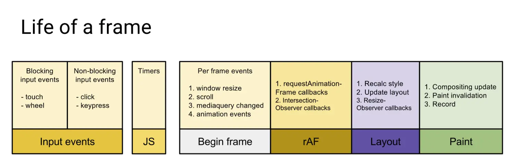
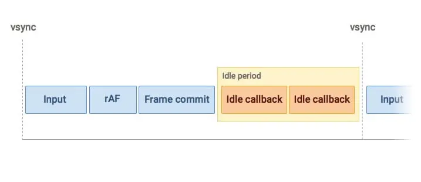

# RequestAnimationFrame 和 RequestIdleCallback

## 概念

### 异步 api

前面的 `Event Loop` 一节已经讨论过异步 `api` ， 我们知道可以使用 `Promise` 、 `setTimeout` 等异步 `api` 来执行耗时任务，但 `Promise` 和 `setTimeout` 主要用于处理耗时的 `js` 脚本 ，对于页面渲染相关的操作则略微不足，回调函数执行时间不确定，可能会导致渲染动画卡顿问题。

本文主要对 `requestAnimationFrame` 和 `requestIdleCallback` 这两个 `api` 进行讨论。


### 帧率

浏览器页面是屏幕一帧一帧绘制出来的，一般每秒刷新 `60` 次，也就是常说的 **帧率** `FPS = 60 Hz` ， 此时的每一帧占用的时间为 `1/60≈16.6` 毫秒，当脚本或其他耗时任务执行超过 `16.6ms` 时，就可能会导致页面卡顿。


## requestAnimationFrame

下图展示浏览器一帧需要完成的任务，主要为 `6` 个步骤



- 处理用户交互
- `js` 解析执行
- 帧开始，窗口大小变更、滚动等处理
- `requestAnimationFrame(rAF)` - （图中还有 `dom` 相关的 `Intersection Observer` 的回调，这里暂不讨论）
- `Layout` 布局
- `Paint` 绘制

由上图可见，每一帧中都会执行 `requestAnimationFrame` 的回调函数，一般使用如下，注意使用 `requestAnimationFrame` 需要每次执行完都要重新注册回调函数

```js
// div 上下来回移动
let offsetTop = 0
let directions = 'down'
const div = document.querySelector(".div")
// 定义 callback
const run = () => {
  if (offsetTop < 0) directions = 'down'
  if (offsetTop > 200) directions = 'up'
  if (directions === 'down') {
    offsetTop++
  } else {
    offsetTop--
  }
  div.style.transform = `translate3d(0, ${offsetTop}px, 0)`

  // 需要重新注册
  window.requestAnimationFrame(run)
};
// 执行
run()
```

## requestIdleCallback


由上图一帧所示，一帧耗时 `16.6ms` ， 如果时间有富余，则会执行 `requestIdleCallback` 的回调函数



与 `requestAnimationFrame` 每帧都执行不同， `requestIdleCallback` 不一定会执行，它是在空闲时间执行，如果浏览器一直在忙碌， `requestIdleCallback` 则一直都执行不到，此时可以设置 `timeout` 来保证倒计时结束后一定执行。


```js
const id = window.requestIdleCallback(callback[, options])
```


- `callback` 回调函数，即空闲时执行的任务，该回调函数接收一个 `IdleDeadline` 对象作入参， `IdleDeadline` 包含有
  - `didTimeout` 布尔值，表示是否超时， `true` 即表示 `callback` 正在被执行（并且上一次执行回调函数执行的时候由于时间超时回调函数得不到执行），即在执行 `requestIdleCallback` 回调的时候指定了超时时间 `timeout` 并且已经超时。
  - `timeRemaining()` 函数，返回当前帧剩余时间 ms 
- `options` 目前支持一个参数
  - `timeout` 表示超过这个时间后，如果任务还没执行，则强制执行，不必等待空闲。


返回一个 `id` ，可以传入 `Window.cancelIdleCallback(id)` 进行结束回调。

```js
// 任务队列
const tasks = [
 () => console.log("第一个任务"),
 () => console.log("第二个任务"),
 () => console.log("第三个任务"),
];

const work = () => {
  console.log('--start--')
  const fn = tasks.shift()
  fn()
}

// 回调
const callback = (deadline) => {
  // 如果帧内有富余的时间，或者超时
  console.log(deadline.timeRemaining(), deadline.didTimeout)
  while ((deadline.timeRemaining() > 0 || deadline.didTimeout) && tasks.length > 0) {
    work();
  }
}

window.requestIdleCallback(callback, { timeout: 2000 });
```

## 最后

`requestIdleCallback` 回调函数是在一帧处理之后，此时页面布局已完成，所以不建议在 `requestIdleCallback` 里操作 `dom` ，这样会导致页面再次重新布局和绘制，建议在 `requestAnimationFrame` 中处理 `dom` 。
