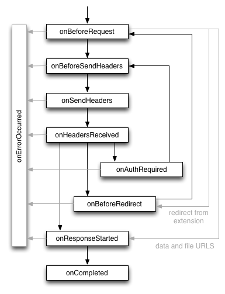
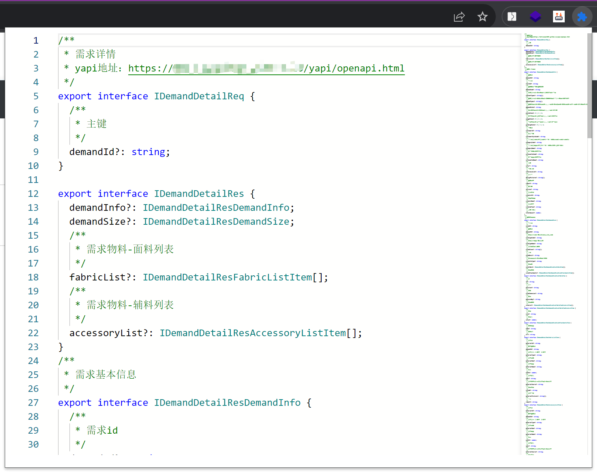
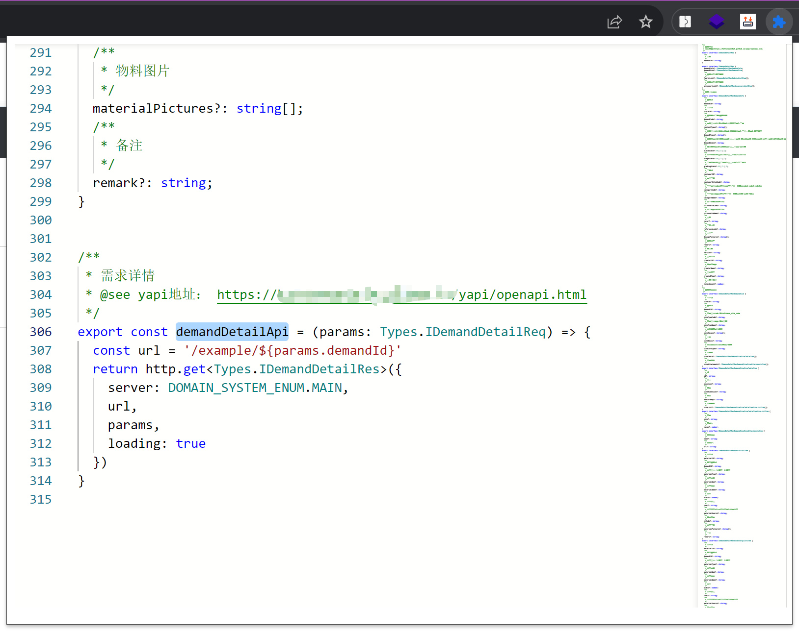

# Chrome 插件


本文由网络文章整理而来，尝试理解 `Chrome` 插件基本概念和结构，并提供 `Demo` 帮助理解和开发一个 `Chrome` 插件。


## 概念

`Chrome Extension` ， 一个增强浏览器功能的程序，本质为使用 `js` 、 `css` 、 `html` 开发的 `web` 程序，后缀为 `.crx` 的压缩包。


## 功能

`Chrome` 插件提供的 `API` 功能大致包含以下：

- 书签控制
- 下载控制
- 窗口控制
- 标签控制
- 网络请求控制，各类事件监听
- 自定义原生菜单
- 通信机制


## 开发和调试

`Chrome` 插件项目比较简洁，只要求项目根目录下包含 `manifest.json` 文件配置即可视为一个 `Chrome` 插件，其他与普通 `web` 程序一样。

本地开发时，不需要打包成 `.crx` ，只需要打开扩展程序管理页面 `chrome://extensions` ， 开启开发者模式，然后点击 `加载已解压的扩展程序` 添加即可进行调试。

注意开发时，改动必须重新加载 `Chrome` 插件。


## 核心概念

- `manifest.json`
- `content_scripts`
- `background`
- `event-pages`
- `popup`
- `injected-script`
- `homepage_url`


### manifest.json

插件必需配置文件，常见配置如下

```json
{
  // 必须，配置文件版本 ， 目前版本是 3
  "manifest_version": 3,
  // 必须，插件的名称
  "name": "chrome_plugin_demo",
  // 必须，插件的版本
  "version": "1.0.0",
  // 插件描述
  "description": "简单的 Chrome 扩展 demo",
  // 图标
  "icons": {
    "16": "imgs/icon.png",
    "48": "imgs/icon.png",
    "128": "imgs/icon.png"
  },
  // 会一直常驻的后台JS或后台页面
  "background": {
    // 2种指定方式，如果指定JS，那么会自动生成一个背景页
    "page": "background.html"
    //"scripts": ["js/background.js"]
  },
  // 浏览器右上角图标设置， action
  "action": {
    "default_icon": "imgs/icon.png",
    // 图标悬停时的标题，可选
    "default_title": "这是一个示例Chrome插件",
    "default_popup": "popup.html"
  },
  // // 当某些特定页面打开才显示的图标
  // "page_action": {
  // 	"default_icon": "img/icon.png",
  // 	"default_title": "我是pageAction",
  // 	"default_popup": "popup.html"
  // },
  // 需要直接注入页面的JS
  "content_scripts": [
    {
      //"matches": ["http://*/*", "https://*/*"],
      // "<all_urls>" 表示匹配所有地址
      "matches": ["<all_urls>"],
      // 多个JS按顺序注入
      "js": ["js/jquery-1.8.3.js", "js/content-script.js"],
      // JS的注入可以随便一点，但是CSS的注意就要千万小心了，因为一不小心就可能影响全局样式
      "css": ["css/index.css"],
      // 代码注入的时间，可选值： "document_start", "document_end", or "document_idle"，最后一个表示页面空闲时，默认document_idle
      "run_at": "document_start"
    },
    // 这里仅仅是为了演示content-script可以配置多个规则
    {
      "matches": ["*://*/*.png", "*://*/*.jpg", "*://*/*.gif", "*://*/*.bmp"],
      "js": ["js/show-image-content-size.js"]
    }
  ],
  // 权限申请
  "permissions": [
    "contextMenus", // 右键菜单
    "tabs", // 标签
    "notifications", // 通知
    "webRequest", // web请求
    "webRequestBlocking",
    "storage", // 插件本地存储
    "http://*/*", // 可以通过executeScript或者insertCSS访问的网站
    "https://*/*" // 可以通过executeScript或者insertCSS访问的网站
  ],
  // 普通页面能够直接访问的插件资源列表，如果不设置是无法直接访问的，格式需为数组，matches 和 resources 也同样是数组
  "web_accessible_resources": [
    {
      "matches": ["https://baidu.com/*"],
      "resources": ["js/inject.js"]
    }
  ],
  // 插件主页，这个很重要，不要浪费了这个免费广告位
  "homepage_url": "https://lafen.gitee.io",
  // 覆盖浏览器默认页面
  "chrome_url_overrides": {
    // 覆盖浏览器默认的新标签页
    "newtab": "newtab.html"
  },
  // Chrome40以后的插件配置页写法
  "options_ui": {
    "page": "options.html",
    // 添加一些默认的样式，推荐使用
    "chrome_style": true
  },
  // 向地址栏注册一个关键字以提供搜索建议，只能设置一个关键字
  "omnibox": {
    "keyword" : "lafen"
  },
  // 默认语言，设置的话，需在根目录有对应的 _locals 文件夹
  "default_locale": "zh_CN",
  // devtools页面入口，注意只能指向一个HTML文件，不能是JS文件
  "devtools_page": "devtools.html"
}
```


### content-scripts

`Chrome` 向页面注入脚本的一种新式（包含 `css` ），借助 `content-scripts` 可以实现通过配置向指定页面注入 `js` 和 `css` （也可以动态注入）


常见配置如上 `manifest.json` 的 `content_scripts` 字段


**特别注意**，如果没有主动指定 `run_at` 为 `document_start` （默认为 `document_idle` ），下面这种代码是不会生效的

```js
document.addEventListener('DOMContentLoaded', function() {
	console.log('我被执行了！');
});
```

`content-scripts` 和原始页面共享 `DOM` ，但是不共享 `js` ， 如果要访问页面 `js` （变量） ，只能通过 `injected js` 来实现。

`content-scripts` 不能访问绝大部分 `chrome.xxx.api` ， 除了以下 `4` 种

- `chrome.extension(getURL, inIncognitoContext, lastError, onRequest, sendRequest)`
- `chrome.i18n`
- `chrome.runtime(connect, getManifest, getURL, id, onConnect, onMessage, sendMessage)`
- `chrome.storage`


### background

后台，常驻页面，它的生命周期最长，跟随浏览器打开关闭，通常把需要一直运行的、启动就运行的、全局的代码放在 `background` 里面。

`background` 的权限非常高，几乎可以调用所有 `Chrome` 扩展 `API` （除了 `devtools` ），而且可以无限制跨域。


需要特别说明的是，虽然你可以通过 `chrome-extension://xxx/background.html` 直接打开后台页，但是你打开的后台页和真正一直在后台运行的那个页面不是同一个。


### event-pages

鉴于 `background` 生命周期太长，长时间挂载后台可能会影响性能，所以 `Google` 又弄一个 `event-pages` ，在配置文件上，它与 `background` 的唯一区别就是多了一个 `persistent` 参数

```json
{
  "background": {
    "scripts": ["event-page.js"],
    "persistent": false
  },
}
```

它的生命周期是：在被需要时加载，在空闲时被关闭。比如第一次安装、插件更新、有 `content-script` 向它发送消息等。


### popup

`popup` 是点击 `browser_action` 或者 `page_action` 图标时打开的一个小窗口网页，焦点离开网页就立即关闭，一般用来做一些临时性的交互。

在权限上，它和 `background` 非常类似，它们之间最大的不同是生命周期的不同， `popup` 中可以直接通过 `chrome.extension.getBackgroundPage()` 获取 `background` 的 `window` 对象


### injected-script

指的是通过 `DOM` 操作的方式向页面注入的一种 `JS` 。

因为 `content-script` 有一个很大的缺陷，就是无法访问页面中的 `js` ，虽然可以操作 `dom` ， 但是无法通过 绑定事件的方式 调用 `content-script` 的方法（ `onclick` 和 `addEventListener` 都不行）。

如果需要在页面上添加一个按钮，并通过该按钮调用扩展的 `API` 的话，就可以在 `content-script` 中通过 `dom` 方式向页面注入 `inject-script`

```js
function injectCustomJs(jsPath) {
  jsPath = jsPath || 'js/inject.js'
  var temp = document.createElement('script')
  temp.setAttribute('type', 'text/javascript')
  // 获得的地址类似：chrome-extension://[chrome extension id]/js/inject.js
  temp.src = chrome.extension.getURL(jsPath);
  temp.onload = function() {
    // 执行完移除掉
    this.parentNode.removeChild(this)
  }
  document.head.appendChild(temp)
}
```

另外还需要在配置中显式声明一下

```json
{
  // 普通页面能够直接访问的插件资源列表，如果不设置是无法直接访问的
  "web_accessible_resources": ["js/inject.js"],
}
```


### homepage_url

插件主页设置，可以设置 `url` 跳转到指定网站


### webRequest

通过 `webRequest` 系列 `api` 可以对 `http` 请求进行任意修改、定制，当然使用时候需要在配置文件中申请权限，其生命周期如下




在 扩展中可以使用 `chrome.webRequest.[xxx].addListener()` 的方式注册其生命周期回调。

但是 使用 `webRequest api` 是无法拿到 `responseBody` 的，想要拿到只能采取其他方式

- 重写 `xmlHttpRequest` 和 `fetch` ，使用 装饰器模式 包装一下，自定义拦截事件
- `devtools` 的 `chrome.devtools.network.onRequestFinished` 的 `API` 可以拿到返回的 `body` ，缺点是必须打开开发者面板
- 使用 `chrome.debugger.sendCommand` 发送 `Network.getResponseBody` 命令来获取 `body` 内容，缺点也很明显，会有一个弹框提示 “xxx 正在调试此浏览器”


## 5 种类型的 js 对比

`Chrome` 插件的 `js` 主要可以分为 `5` 种

- `injected script`
- `content-script`
- `popup js`
- `background js`
- `devtool js`


### 权限对比

| js | 可访问的 api | dom 访问 | js 访问 | 直接跨域 |
| - | - | - | - | - |
| injected script | 和普通 js 无差别，不能访问任何 扩展 api | 可以访问 | 可以访问 | 不可以 |
| content script | 只能访问 extension 、 runtime 等部分 api | 可以访问 | 不可以 | 不可以 |
| popup js | 可访问绝大部分 API ，除了 devtools 系列 | 不可直接访问 | 不可以 | 可以 |
| background js | 可访问绝大部分 API ，除了 devtools 系列 | 不可直接访问 | 不可以 | 可以 |
| devtools js | 只能访问 devtools、extension、runtime 等部分 API | 可以 | 可以 | 不可以 |


## 通信概览

> `-` 表示未查文档， 表格表示 第一列 向 第一行 发送数据的通信方式

| - | injected-script | content-script | popup-js | background-js |
| - | - | - | - | - |
| injected-script | - | window.postMessage | - | - |
| content-script |window.postMessage|-|chrome.runtime.sendMessage 、 chrome.runtime.connect|chrome.runtime.sendMessage 、 chrome.runtime.connect|
| popup-js |-|chrome.tabs.sendMessage 、 chrome.tabs.connect|-|chrome.extension.getBackgroundPage()|
| background-js |-|chrome.tabs.sendMessage 、 chrome.tabs.connect|chrome.extension.getViews|-|
| devtools-js |chrome.devtools.inspectedWindow.eval|-|chrome.runtime.sendMessage|chrome.runtime.sendMessage|


## Chrome 插件 Demo


### Demo 地址

`Demo` 地址见 [Demo](https://gitee.com/lafen/yapi-ts-extension)


### Demo 说明

常规简易 `web` 程序，未做具体打包事项。

插件开发时主要在于捋清各个 `js` 文件之间的通信关系，以及数据结构的处理，主要功能根据 `yapi` 接口文档生成相应的 `ts` 类型，主要涉及的关键点如下：

- 数据拦截
  - 插件根目录必须 `manifest.json` 文件，相关配置可以看以上文章
  - 在页面加载前由 `content` 向 页面 注入 `inject`
  - `inject` 通过拦截 `xhr` 来获取到接口返回的数据，通过 `window.postMessage` 发送回 `content`
  - `content` 再将数据通过 `chrome.runtime.sendMessage` 发送给 `background`
  - `background` 将数据通过 `chrome.storage.local` 保存到本地储存
  - 这样 `popup` 中就能在打开时候从本地储存中获取到了接口数据了
- `ts` 类型生成
  - 使用 `json-schema-to-typescript` 对数据进行 `ts` 类型转换
  - 使用 `monaco-editor` 将 `ts` 类型显示到 `popup` 上

- 效果如下
  - 生成接口入参、出参 `ts` 类型 及 注释
  
  - 生成 `api` 方法 和 对应的 `yapi` 地址
  


## Sources

[Chrome插件(扩展)开发全攻略](http://blog.haoji.me/chrome-plugin-develop.html#xie-zai-qian-mian)

[json-schema-to-typescript](https://github.com/bcherny/json-schema-to-typescript.git)

[monaco-editor](https://github.com/microsoft/monaco-editor.git)
