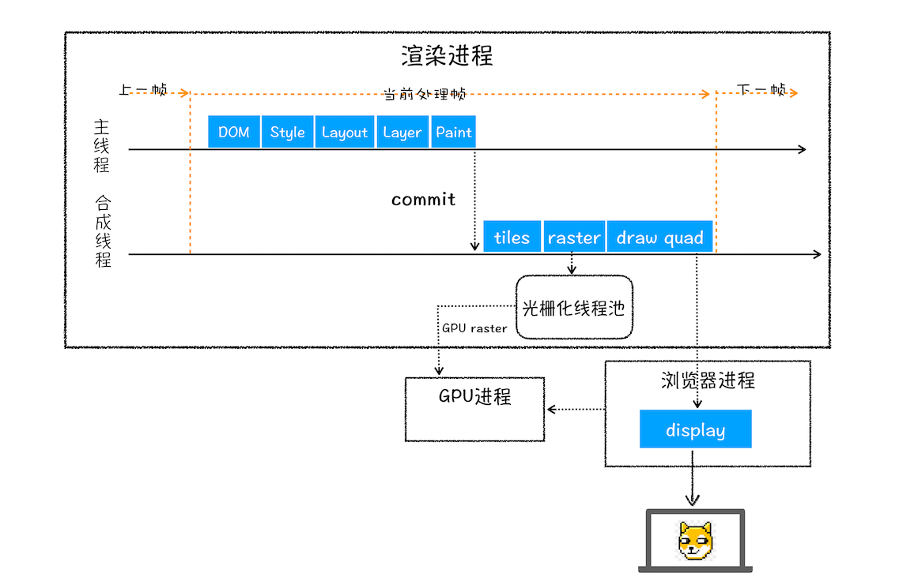
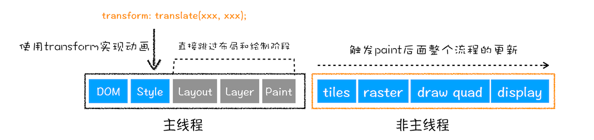

# 分层与合成


## 渲染流程

一个大致渲染流程可以总结如下

- 渲染进程将 `HTML` 内容转换为能够读懂的 `DOM` 树结构。
- 渲染引擎将 `CSS` 样式表转化为浏览器可以理解的 `styleSheets` ，计算出 `DOM` 节点的样式。
- 创建 **布局树** ，并计算元素的布局信息。
- 对 布局树 进行 分层 ，并生成 **分层树** 。
- 为每个图层生成绘制列表，并将其提交到 合成线程 。
- 合成线程将图层分成 图块 ，并在 光栅化线程池 中将图块转换成 位图 。
- 合成线程 发送绘制图块命令 `DrawQuad` 给 浏览器进程。
- 浏览器进程根据 `DrawQuad` 消息生成页面，并显示到显示器上




## 重排、重绘、合成

在渲染流水线中，生成一帧的方式有 `3` 种

- 重排 ， 一般更新元素的几何属性会触发
  

- 重绘 ， 更新元素的绘制属性
  

- 合成
  


这三种方式的渲染路径是不同的，通常渲染路径越长，生成图像花费的时间就越多。

- 重排，需要重新根据 `CSSOM` 和 `DOM` 来计算布局树，会让整个渲染流水线的每个阶段都执行一遍
- 重绘 因为没有了重新布局的阶段，操作效率稍微高点，但是依然需要重新计算绘制信息，并触发绘制操作之后的一系列操作
- 合成 ，不需要触发布局和绘制，在 **合成线程** 上进行，不占用主线程，流畅效率高


## 分层、合成

页面上存在炫酷动画时，没有采用 分层 的话，就可能会导致频繁的进行渲染流水线的执行，导致页面卡顿。为了提升渲染效率， `chrome` 引入了分层和合成机制。

**分层** 和 **合成** 通常是一体的，我们所看到的页面都是平面，但是网页呈现也像 `PS` 的图层一般，可以由大大小小的**图层**来堆叠而成的。

**分层** 体现在生成 布局树 之后，渲染引擎会根据布局树的特点将其转换成层数（ `Layer Tree` ），层树中每一个节点都对应一个图层，每个图层对应绘制一张图片，最后绘制时将这些 图片 合成 “一张” 图片。这就是大致的 分层 、 合成 流程。


## 开启分层

通常满足下面两点中任意一点的元素就可以被提升为单独的一个图层。

- 拥有层叠上下文属性的元素会被提升为单独的一层
  
  
  图中可以看出，明确 **定位属性** 的元素、定义 **透明属性** 的元素、使用 `CSS` 滤镜的元素等，都拥有 **层叠上下文属性** 。

- 需要剪裁（ `clip` ）的地方也会被创建为图层，即需要滚动的元素也会创建一个单独的图层

- will-change

  通过 `will-change` 属性来提前告知渲染引擎对元素的一些特效变换，生成 分层

  ```css
  .box {
    will-change: tranfrom, opacity;
  }
  ```


## Finally

分层渲染并没有涉及到主线程，这样就大大提升了渲染的效率。这也是 `CSS` 动画比 `JavaScript` 动画高效的原因。

但是凡事都有两面性，每当渲染引擎为一个元素准备一个独立层的时候，它占用的内存也会大大增加，因为从层树开始，后续每个阶段都会多一个层结构，这些都需要额外的内存，所以你需要恰当地使用 `will-change` 等属性来开启分层


## Source

[Post](https://blog.poetries.top/browser-working-principle/)

