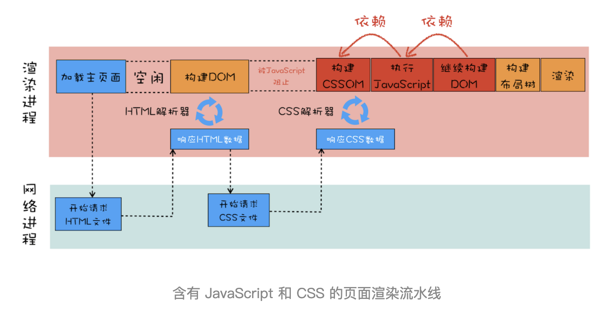

# H5C3

- `flex` 布局
- `grid` 布局
- `css` 作用域 `css module` 、 `scoped`
- `css` 原子化 `tailwind css` 、 `windi css` 、 `unocss`
- 移动端适配方案
- 分层与合成：为什么 `css` 动画比 `js` 高效

## 常见问题

- `margin` 重叠问题
- `inline-block` 元素空白问题
- `bfc` 概念
- 水平、垂直居中问题

## 为什么 html 中 css 样式 在前，script 在后

- 浏览器 顺序解析 `html` ，根据 `dom` 生成 `dom` 树，根据 `css` 生成 `cssom` 树，然后根据这两个生成 `render` 树；
- 解析 `dom` 的时候遇到 `script` 会暂停 `dom` 解析，去下载、解析、运行 `script` 文件，耗时过长会导致页面一直空白，所以 `script` 一般放在 `dom` 的最后；
- `css` 的 `link` 一般不会阻塞 `dom` 的解析，但是生成 `render` 树前需要先生成 `cssom` ，否则也会白屏，所以 `link` 一般放在 `dom` 前面先。
- 实际上， `js` 的下载、运行 依赖 `CSSOM` ，因为 `js` 中有可能修改 `css` 样式，所以需要等待 `css` 的下载解析，间接导致了 `dom` 解析的阻塞。

## 浏览器 回流 和 重绘

- 更新 `dom` 元素的几何属性（如宽、高等）会触发 回流、重绘
- 更新 `dom` 元素的 绘制属性（背景色） 则 不会 触发回流、只会重绘
- 使用 `CSS` 的 `transform` 来实现动画效果，这可以避开 回流 和 重绘 阶段，直接在非主线程上执行合成动画操作，能大大提升绘制效率
- 复杂动画元素使用 `will-change` 属性提前告知浏览器该元素将执行复杂动画，让浏览器提前做优化

## script 的 defer 和 async

-  默认情况下，脚本的下载和执行会按照文档的先后顺序解析执行。当脚本下载和执行时，文档解析就会被阻塞，在脚本下载和执行完后再继续解析。
-  `defer` 属性在 `script` 标签中表示 **异步加载脚本**，等文档解析完毕后再执行。
-  `async` 属性表示 异步加载脚本，脚本加载完后会 停止文档解析，转而去执行该脚本。
-  `async` 和 `defer` 同时出现，则 `async` 优先。

## 盒模型

布局模型可通过 `box-sizing` 进行设置，不同值，其计算区域不同：

| 模型                       | box-sizing  | 计算区域                    |
| -------------------------- | ----------- | --------------------------- |
| **W3C 标准盒模型**（默认） | content-box | width/height                |
| **IE盒模型**               | border-box  | width/height+padding+border |
| 其他                       | padding-box | width/height+padding        |

## css 兼容方案

- 浏览器 `css` 样式初始化，抹平浏览器间的差异（`normalize.css`）
- 添加 `css` 属性前缀（`-webkit-`、`-moz-`、`-ms-`）
- 自动化插件（ `Autoprefixer` 插件）

## rgba 和 opacity 的透明效果区别

- `rgba` 只作用于 **当前元素** 颜色和背景色，其 子元素 和 内容 不会继承 透明效果。
- `opacity` 作用于元素，以及元素内 所有内容 的 透明度。
