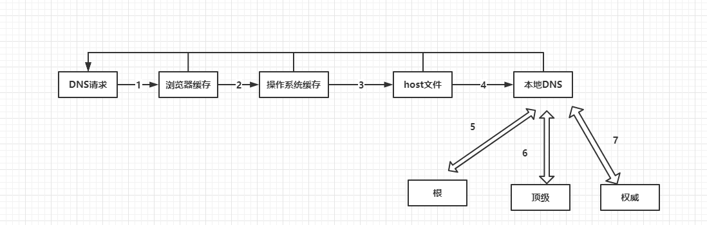

# DNS 查询

`DNS` 查询是 域名的 `IP` 地址查询过程，其中会依次经过 **递归查询**、**迭代查询**，如客户端发起一个 `DNS` 查询流程

1. 本地 浏览器 首先查询是否有该 域名 的缓存，有则返回
2. 查询 操作系统 中是否缓存该域名
3. 查询 本地 `host` 是否缓存该域名
4. 请求 本地 `DNS` 服务器，看是否缓存了该域名
5. 如果还找不到，本地 `DNS` 服务器则请求 **根域名服务器**。例如 想要查找 `www.baidu.com` 的 `IP` 地址，根域名服务器 会返回 `.com` 这个 顶级域名服务器 的 `IP` 地址，让 本地 `DNS` 服务器去这里找
6. 本地 `DNS` 服务器向 **顶级域名服务器** 发起查询 `www.baidu.com` 的 `IP` 地址 请求，返回该域名地址的 **权威服务器** 地址
7. 本地 `DNS` 服务器 向 **权威服务器** 发起查询 `www.baidu.com` 的 `IP` 地址 请求，返回该域名的 `IP` 地址
8. 本地 `DNS` 服务器将 查到的 `IP` 地址返回给客户端
9. 缓存 该 `IP` 地址

> 其中 第 `1 - 4` 为 递归查询 ， `5 - 7` 为 迭代查询

域名的层级关系类似于一个树状结构

- 根 `DNS` 服务器（ `.` ）
- 顶级域名服务器（ `.com` ）
- 权威 `DNS` 服务器（ `server.com` ）