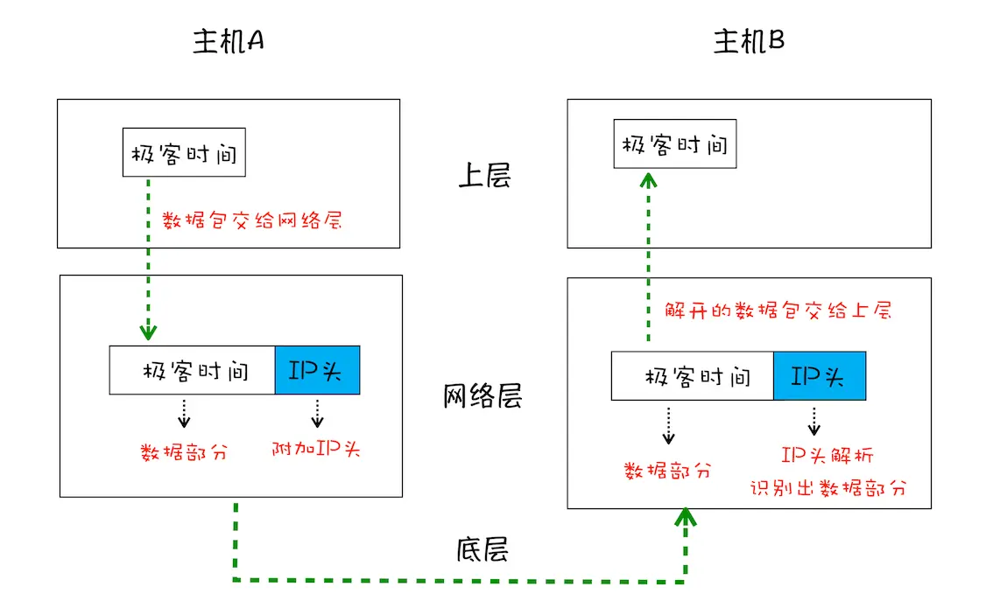
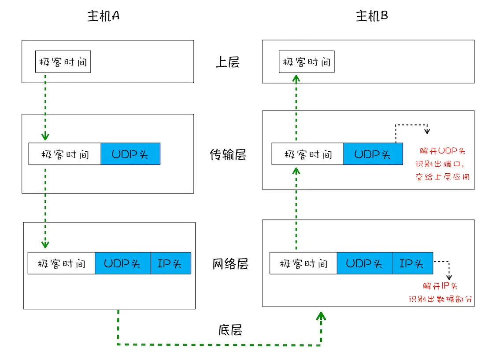
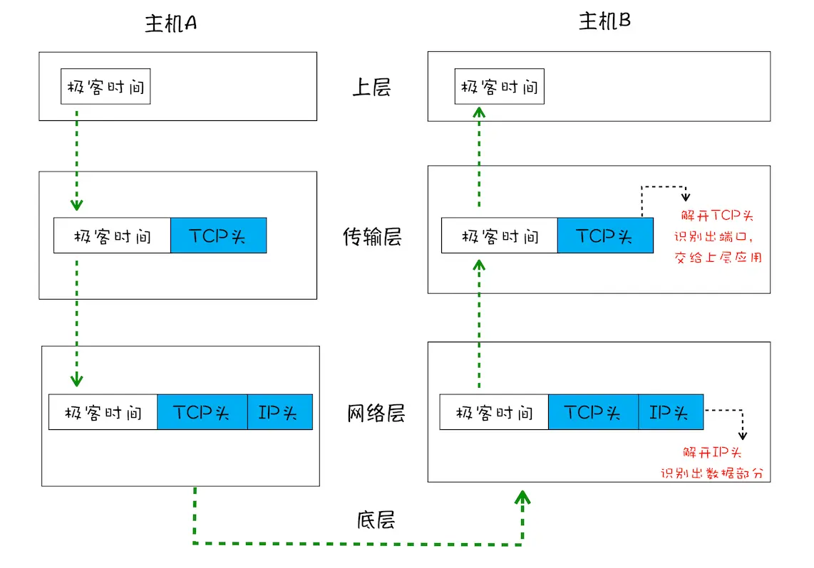
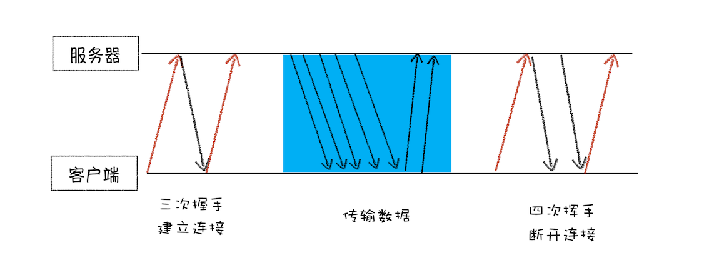

# TCP/IP/UDP

## IP

> IP：把数据包送达目的主机，网际协议（Internet Protocol，简称IP）

数据传输需要使用 `IP` 协议，通过互联网的在线设备的 `IP` 地址进行设备间的数据传输，访问任何网站实际上只是你的计算机向另一台计算机请求信息。

如果想要把一个数据包从 `主机A` 发送给 `主机B` ，数据包中应当包含 `主机A` 和 `主机B` 的 `IP` 地址，这样才能做到正确寻址，这些信息会被装进一个叫 `IP头` 的数据结构里。`IP头` 是 `IP` 数据包开头的信息，包含 `IP 版本`、`源 IP 地址`、`目标 IP 地址`、`生存时间`等信息。

## UDP

> UDP：把数据包送达应用程序，用户数据包协议（User Datagram Protocol）

`IP` 是非常底层的协议，只负责把数据包传送到对方电脑，但是对方电脑并不知道把数据包交给哪个程序，是交给浏览器还是交给王者荣耀？因此，需要基于 `IP` 之上开发能和应用打交道的协议，最常见的是“用户数据包协议（`User Datagram Protocol`）”，简称 `UDP` 。

`UDP` 中一个最重要的信息是**端口号**，端口号其实就是一个数字，每个想访问网络的程序都需要绑定一个端口号。通过端口号 `UDP` 就能把指定的数据包发送给指定的程序了，所以**IP通过 IP 地址信息把数据包发送给指定的电脑，而 UDP 通过 端口号 把数据包分发给正确的程序**。和 `IP` 头一样，端口号会被装进 `UDP头` 里面， `UDP头` 再和原始数据包合并组成新的 `UDP数据包`。`UDP头` 中除了 目的端口，还有 源端口号 等信息

## TCP

> TCP：（Transmission Control Protocol，传输控制协议）

对于浏览器请求，或者邮件这类要求数据传输可靠性（`reliability`）的应用，如果使用 `UDP` 来传输会存在两个问题：

- 数据包在传输过程中容易丢失；
- 大文件会被拆分成很多小的数据包来传输，这些小的数据包会经过不同的路由，并在不同的时间到达接收端，而 `UDP` 协议并不知道如何组装这些数据包，从而把这些数据包还原成完整的文件。

基于这两个问题，我们引入 `TCP` 了。`TCP`（`Transmission Control Protocol`，传输控制协议）是一种**面向连接的**、**可靠的**、**基于字节流**的传输层通信协议。相对于 `UDP` ， `TCP` 有下面两个特点:

- 对于数据包丢失的情况， `TCP` 提供**重传机制**；
- `TCP` 引入了**数据包排序**机制，用来保证把乱序的数据包组合成一个完整的文件。

和 `UDP头` 一样， `TCP头` 除了包含了 目标端口 和 本机端口号 外，还提供了用于 排序 的 序列号，以便接收端通过 序号 来重排数据包。

一个完整的 `TCP` 连接的生命周期包括 **建立连接** 、 **传输数据** 和 **断开连接** 三个阶段。

- **首先，建立连接阶段**。这个阶段是通过 **三次握手** 来建立客户端和服务器之间的连接。 · 提供面向连接的通信传输。面向连接是指在数据通信开始之前先做好两端之间的准备工作。所谓 三次握手，是指在建立一个 `TCP` 连接时，客户端和服务器总共要发送 三个数据包 以确认连接的建立。
- **其次，传输数据阶段**。在该阶段，接收端需要对每个数据包进行确认操作，也就是接收端在接收到数据包之后，需要发送确认数据包给发送端。所以当发送端发送了一个数据包之后，在规定时间内没有接收到接收端反馈的确认消息，则判断为数据包丢失，并触发发送端的**重发机制**。同样，一个大的文件在传输过程中会被拆分成很多小的数据包，这些数据包到达接收端后，接收端会按照 `TCP头` 中的序号为其 **排序** ，从而保证组成完整的数据。
- **最后，断开连接阶段**。数据传输完毕之后，就要终止连接了，涉及到最后一个阶段 **四次挥手** 来保证双方都能断开连接。

到这里你应该就明白了， `TCP` 为了保证数据传输的可靠性，牺牲了数据包的传输速度，因为 **三次握手** 和 **数据包校验机制** 等把传输过程中的数据包的数量提高了一倍。

## TCP/IP 总结

- 互联网中的数据是通过数据包来传输的，数据包在传输过程中容易丢失或出错。
- `IP` 负责把数据包送达目的主机。
- `UDP` 负责把数据包送达具体应用。
- 而 `TCP` 保证了数据完整地传输，它的连接可分为三个阶段：建立连接、传输数据 和 断开连接。
- 其实了解 `TCP` 协议，是为了全方位了解 `HTTP` ，包括其实际功能和局限性，之后才会更加深刻地理解为什么要推出 `HTTP/2` ，以及为什么要推出 `QUIC` 协议，也就是未来的 `HTTP/3` 。

