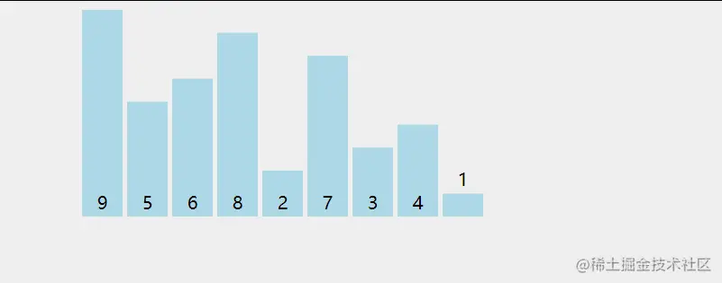
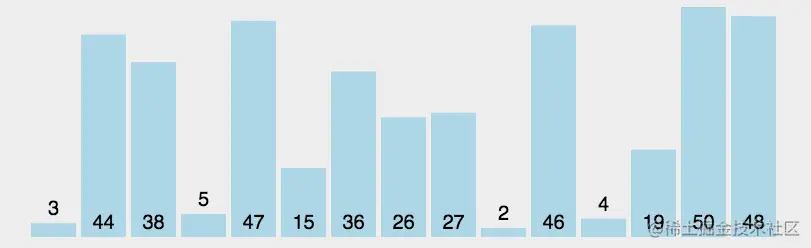
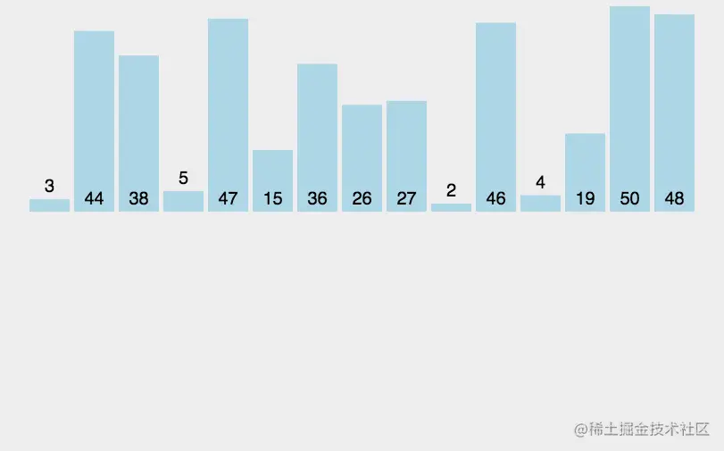
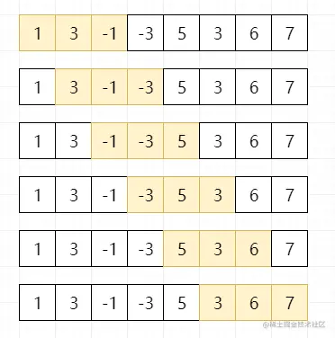

# JS 代码


## 实现 compose 函数，类似 koa 中间件洋葱模型

```js
const middleware = []
middleware.push((next) => {
  console.log(1)
  next()
  console.log(1.1)
})
middleware.push((next) => {
  console.log(2)
  next()
  console.log(2.1)
})
middleware.push((next) => {
  console.log(3)
  next()
  console.log(3.1)
})

const fn = compose(middleware)
fn() // 1 - 2 - 3 - 3.1 - 2.1 - 1.1
```

`compose` 函数实现

```js
// 不是 promise 实现
const compose = (middleware) => {
  return () => {
    const dispatch = (i) => {
      if (i === middleware.length) {
        return
      }
      const fn = middleware[i]
      const next = () => {
        // 在 next() 的时候，调用数组中的下一个中间件函数
        dispatch(i + 1)
      }
      fn(next)
    }
    dispatch(0)
  }
}

// koa2 框架的中间件实现原理
function compose (middleware) {
  // 提前判断中间件类型,防止后续错误
  if (!Array.isArray(middleware)) throw new TypeError('Middleware stack must be an array!')
  for (const fn of middleware) {
    // 中间件必须为函数类型
    if (typeof fn !== 'function') throw new TypeError('Middleware must be composed of functions!')
  }
  return function (context, next) {
    // 采用闭包将索引缓存,来实现调用计数
    let index = -1
    return dispatch(0)
    function dispatch (i) {
      // 防止next()方法重复调用
      if (i <= index) return Promise.reject(new Error('next() called multiple times'))
      index = i
      let fn = middleware[i]
      if (i === middleware.length) fn = next
      if (!fn) return Promise.resolve()
      try {
        // 包装next()返回值为Promise对象
        return Promise.resolve(fn(context, dispatch.bind(null, i + 1)));
      } catch (err) {
        // 异常处理
        return Promise.reject(err)
      }
    }
  }
}
```


## 虚拟 dom 转真实 dom

```js
const vnode = {
  tag: 'DIV',
  attrs: {
    id: 'app'
  },
  children: [
    {
      tag: 'SPAN',
      children: [
        {
          tag: 'A',
          children: ['router', 'link']
        }
      ]
    },
    {
      tag: 'SPAN',
      children: [
        {
          tag: 'A',
          children: ['go']
        },
        {
          tag: 'A',
          children: []
        }
      ]
    }
  ]
}
```


关键 `api` 

- `document.createElement(tagName)` 新建 dom
- `ele.setAttribute(attr, value)` 设置 attr 属性
- `parent.appendChild(ele)` 子元素放置


```js
const render = (vnode) => {
  const toDom = (node, parent = null) => {
    // 文本
    if (typeof node === 'string' && parent) {
      parent.innerText += node
      return parent
    }
    // 标签
    const { tag, attrs, children } = node
    const ele = document.createElement(tag.toLowerCase())
    // 处理 attrs
    if (attrs) {
      Object.keys(attrs).forEach(key => {
        ele.setAttribute(key, attrs[key])
      })
    }
    // 处理 子元素
    if (children && children.length) {
      children.forEach(child => {
        toDom(child, ele)
      })
    }
    // 父级挂载
    if (parent) {
      parent.appendChild(ele)
    } else {
      parent = ele
    }

    return parent
  }

  const dom = toDom(vnode)
  return dom
}

// 测试
render(vnode)
```


## 版本号排序

输入一组版本号，输出从大到小的排序

```js
const versions = ['2.1.0.1', '0.402.1', '10.2.1', '5.1.2', '1.0.4.5']

const versionSort = (list) => {
  return list.sort((v1, v2) => {
    let i = 0
    const arr1 = v1.split('.')
    const arr2 = v2.split('.')
    while(true) {
      // 取出同位置数字
      const s1 = arr1[i]
      const s2 = arr2[i]
      i++
      // 其中一个小版本号空了，则比较完毕
      if (s1 === undefined || s2 === undefined) {
        return arr2.length - arr1.length
      }
      // 相同则继续对比下一个小版本号
      if (s1 === s2) continue
      // 否则比较 小版本数字大小
      return s2 - s1
    }
  })
}

versionSort(versions) //  ['10.2.1', '5.1.2', '2.1.0.1', '1.0.4.5', '0.402.1']
```


## 文件大小单位转换

将文件的 `KB` 单位简化，保留两位小数，例如 `1024KB => 1024MB`

```js
const formatSizeUnit = (kb) => {
  const units = ['KB', 'MB', 'GB', 'TB', 'PB']
  let index = 0
  while(kb >= 1024 && index < units.length - 1) {
    kb /= 1024
    index++
  }
  return `${kb.toFixed(2)} ${units[index]}`
}

formatSizeUnit(1024)
```


## 数组 转 树

使用 `map` 来缓存 `id` 和 对应的数组元素 `id -> treeItem` ， 遍历时判断 `map` 中是否存在 `parentId` 对应的 `id` ， 存在则将 `treeItem` 保存到 `parentItem.children` 中

```js
const list = [
  { id: 1, name: '部门A', parentId: 0 },
  { id: 2, name: '部门B', parentId: 1 },
  { id: 3, name: '部门C', parentId: 1 },
  { id: 4, name: '部门D', parentId: 2 },
  { id: 5, name: '部门E', parentId: 3 },
  { id: 6, name: '部门F', parentId: 3 },
];

const convertArrToTree = (arr) => {
  let root = null;
  const idMap = new Map();
  arr.forEach((item) => {
    // tree item
    const { id, parentId, name } = item;
    const treeItem = { id, name };
    // 缓存
    idMap.set(id, treeItem);
    // 找到 parent 并 push 到 children
    const parentItem = idMap.get(parentId);
    if (parentItem) {
      if (parentItem.children === undefined) {
        parentItem.children = [];
      }
      parentItem.children.push(treeItem);
    }

    // 是根节点的话赋值给 root
    if (parentId === 0) {
      root = treeItem;
    }
  });
  return root;
}

console.log(convertArrToTree(list));
```


## 排序

### 冒泡排序

两层遍历，注意遍历范围，相邻元素进行比较交换位置

> 复杂度 `O(n²)` ，稳定排序算法



```js
const list = [2, 4, 1, 666, 23, 12, 67, 99]

const bubbleSort = (arr) => {
  // 外层 遍历 控制排序进行多少轮
  for(let i = 0; i < arr.length; i++) {
    // 内层 遍历 控制相邻的数据比较
    for(let j = 0; j < arr.length - i - 1; j++) {
      if (arr[j] > arr[j + 1]) {
        // 前一个比后一个大，则交换位置
        [arr[j], arr[j + 1]] = [arr[j + 1], arr[j]]
      }
    }
  }
  return arr
}
```


### 选择排序

两层遍历，每次遍历找到剩余元素中的最小值，选择最小值插到已排序的元素后面

> 复杂度 `O(n²)` ，不稳定排序算法



```js
const list = [2, 4, 1, 666, 23, 12, 67, 99]

const selectSort = (arr) => {
  // 剩余中最小值的下标
  let minIndex
  // 外层 遍历 控制排序进行多少轮
  for(let i = 0; i < arr.length; i++) {
    minIndex = i
    // 从当前指针开始 找小于当前的 最小的 值
    for(let j = i + 1; j < arr.length; j++) {
      if (arr[j] < arr[minIndex]) {
        // 遍历找到最小的值的下标
        minIndex = j
      }
    }
    // 如果剩余最小值的下标不是当前指针，则交换
    if (minIndex !== i) {
      [arr[i], arr[minIndex]] = [arr[minIndex], arr[i]]
    }
  }
  return arr
}
```


### 插入排序

取剩余元素第一个元素作为目标元素，往前遍历已排序的元素并移动，找到比目标元素小的，则插入到目标元素后面

> 复杂度 `O(n²)` ，稳定排序



```js
const list = [2, 4, 1, 666, 23, 12, 67, 99]

const insertSort = (arr) => {
  // 从第二个元素开始遍历
  for (let i = 1; i < arr.length; i++) {
    let p = i
    // 记录要插入的目标元素
    const target = arr[p]
    // 从 target 所在位置向前遍历，直到找到一个比目标元素小的，然后插在后面
    while(p > 0 && arr[p - 1] > target) {
      // 移动前一个元素到下一个位置
      arr[p] = arr[p - 1]
      p--
    }
    arr[p] = target
  }
  return arr
}
```


### 快速排序

使用递归，将中间元素放置在新数组中间，比中间元素大的放右边，小的放左边

> 时间复杂度为 `O(nlogn)` ，不稳定排序


```js
const list = [2, 4, 1, 666, 23, 12, 67, 99]

const quickSort = (arr) => {
  // 递归结束条件
  if (arr.length <= 1) return arr
  // 中间节点
  const mid = Math.floor(arr.length / 2)
  // 以中间节点为基准，比中间大的放 right ，小的 放 left
  const base = arr.splice(mid, 1)[0] // 先移除中间节点
  const left = [], right = []
  for (const item of arr) {
    if (item > base) {
      right.push(item)
    } else {
      left.push(item)
    }
  }
  // 递归，重新组合数组，base 重新放置在 中间
  return [...quickSort(left), base, ...quickSort(right)]
}
```


### 打乱数组 - 洗牌算法

长度为 `n` 的数组的全排列有 `n!` 种，也就是说打乱结果总共有 `n!` 种。

洗牌算法，产生的结果必须有 `n!` 种可能，否则无法做到真的打乱了。

```js
const nums = [1, 2, 3, 4, 5]
const shuffle = (arr) => {
  const n = arr.length
  for (let i = 0; i < n; i++) {
    const r = Math.floor(i + Math.random() * (n - i))
    const t = arr[i]
    arr[i] = arr[r]
    arr[r] = t
  }
  return arr
}
```


## 二叉树遍历

### 广度优先遍历

> 队列（先进后出）， 每个节点都需将左右子节点从右边入队，遍历时从左边出队

```js
const breadthFirst = (root) => {
  const arr = [];
  if (!root) return arr;
  // 维护队列
  const stack = [root];
  while(stack.length) {
    // 出队
    const node = stack.shift();
    arr.push(node.val);
    // 入队
    node.left && stack.push(node.left);
    node.right && stack.push(node.right);
  }
  return arr;
}
```


### 深度优先遍历

> 递归，类似前序遍历

```js
const arr = [];
const depthFirst = (root) => {
  if (!root) return arr;
  arr.push(root.val);
  root.left && depthFirst(root.left);
  root.right && depthFirst(root.right);
}
arr;
```


### 层序遍历

> 递归，注意要先遍历完一层，才能进行下一层遍历，返回值应该是一个二维数组，分别用于储存每一层的节点值

```js
const levelOrder = (root) => {
  const arr = []
  if (!root) return arr

  const stack = [root]
  while(stack.length) {
    let len = stack.length
    // 一层一个数组临时储存
    const tmp = []
    while(len--) {
      const node = stack.shift()
      tmp.push(node.val)
      // 按顺序 入队
      node.left && stack.push(node.left)
      node.right && stack.push(node.right)
    }
    // 遍历完一层，push 进 arr
    arr.push(tmp)
  }
}
```


## 滑动窗口最大值

给定一个数组 `nums` ，有一个大小为 `k` 的滑动窗口，从数组的最左侧移动到数组的最右侧。你只可以看到在滑动窗口中的 `k` 个数字。滑动窗口每次只向右移动一位，求返回 滑动窗口中的最大值



```js
const nums = [1, 3, -1, -3, 5, 3, 6, 7], k = 3

const maxSlideWindow = (nums, k) => {}
```


## 最长递增子序列

一个整数数组 `nums` ，找到其中一组最长递增子序列的值


## 买卖股票


## 字符串所有排列组合

输入一个字符串，打印出该字符串中，所有字符的排列组合

```js
const str = 'abc'

const combine = () => {}
```
