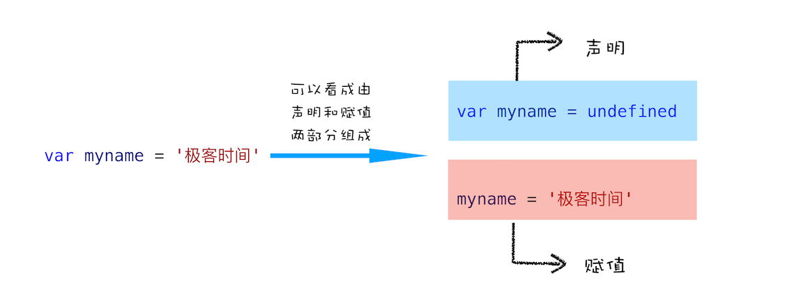
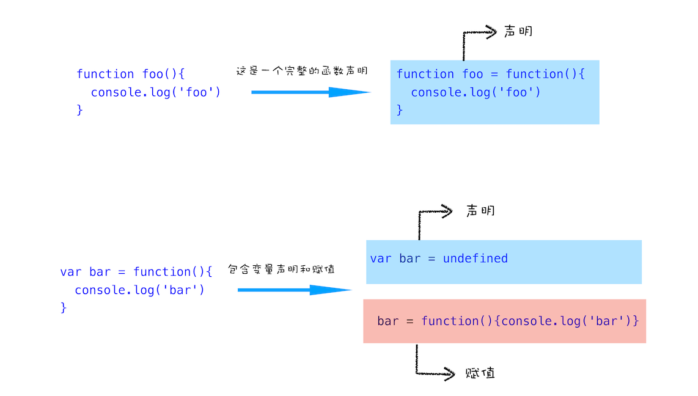
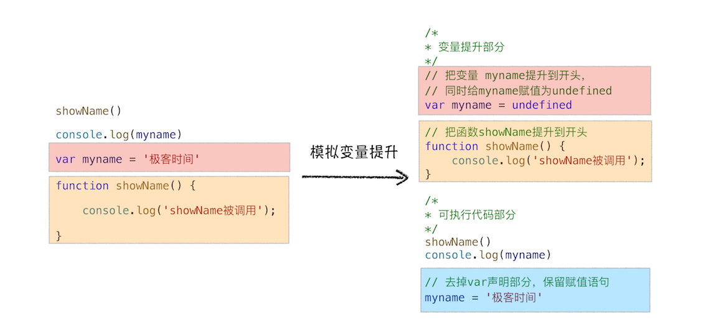
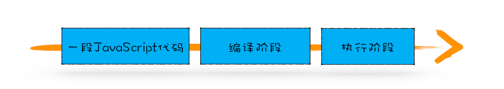

# JS 变量提升


我们知道 `js` 是顺序执行，但是看下以下代码

```js
showName()
console.log(myname)
var myname = '极客时间'
function showName() {
  console.log('函数showName被执行');
}
```

如果程序按照 顺序执行 的话，以上代码将会报错，但实际上却不会，复制到浏览器控制台打印

```js
函数showName被执行
undefined
```


这是 `js` 中的特性导致，即 **变量提升**


## 变量提升（Hoisting）

### 变量

变量提升不难理解，就是变量会被提升到作用域顶部，早期 `js` 设计时遗留的问题，可以将上面的变量声明赋值代码看成以下




### 函数

接下来看下函数的声明

```js
function foo(){
  console.log('foo')
}

var bar = function(){
  console.log('bar')
}
```

同样可以看成以下




### 变量提升简述

所谓的 变量提升 ，是指在 `JavaScript` 代码执行过程中， `JavaScript` 引擎把 变量 的声明部分和 函数 的声明部分提升到代码开头的 行为 。变量被提升后，会给变量设置默认值，这个默认值就是我们熟悉的 `undefined` 。


### 变量提升模拟

以上代码模拟变量提升如下图




## js 代码的执行流程

**变量提升** 的存在意味着代码在执行之前，浏览器是做了类似于上面我们模拟的将声明移动到最前面的做法。

但是，移动代码到最前面这个说法并不准确，实际上变量和函数在代码中的位置是不会变的，是在 **编译阶段**，被 `js` 引擎存放到了内存中。

一段 `js` 代码，是需要经过 **编译** 之后才会进入 **执行** 阶段的。




### 编译阶段

我们有了 `js` 编译、执行的概念后，可以将上面代码，根据这个过程画图如下


由图可知，经过编译后，会生成两部分内容

- 执行上下文
- 可执行代码


#### 执行上下文

执行上下文是 `JavaScript` 执行一段代码时的运行环境，比如调用一个函数，就会进入这个函数的执行上下文，确定该函数在执行期间用到的诸如 `this` 、变量、对象 以及 函数 等

执行上下文中保存的是 **变量环境对象**，可以看成结构如下

```c++
VariableEnvironment:
  myname -> undefined, 
  showName ->function : {console.log(myname)}
```

编译阶段， `js` 引擎就将 变量 和 函数 保存到了 **变量环境对象** 中。


### 执行阶段

执行阶段就比较好理解了，就是顺序执行下来，遇到 变量 或 函数 就从 **执行上下文中** 查找。


## 同名的函数提升

观察以下代码，输出的是什么

```js
function showName() {
  console.log('极客邦');
}
showName();
function showName() {
  console.log('极客时间');
}
showName(); 
```

记住一个结论，就是 `js` 代码是需要经过 **编译 - 执行** 的，所以以上代码可以做如下分析

- **编译阶段**， `js` 引擎会查找代码中的声明语句，发现两个同名的函数声明，此时后者会覆盖前者
- **执行阶段**， 遇到 `showName()` ，从执行上下文中找到函数并调用，所以其实两次调用打印的都是后者


## 函数提升是最高优先级

同名的变量和函数，函数提升会覆盖变量提升

```js
console.log(typeof showName) // function
// 变量
var showName = 999 // 执行阶段，覆盖了原来的函数
console.log(typeof showName) // number
// 函数
function showName() {
  console.log(1)
}
console.log(typeof showName) // number
```

- 编译阶段，函数声明覆盖了变量
- 执行阶段，变量的赋值，覆盖了原来的函数声明


## 总结

- `js` 是顺序执行的，但是需要经过 **编译 - 执行** 阶段，编译 过程存在 **变量提升** ，这是 `js` 早期为了方便简单做的设计
- 同名函数 会在 编译阶段 被后者覆盖
- **函数声明提升** 优先级高于 **变量提升**
- `js` 是 先编译后执行


## Finally

观察如下代码，输出什么

```js
showName()
var showName = function() {
  console.log(2)
}
function showName() {
  console.log(1)
}
showName()
```

- 编译阶段
  ```js
  var showName
  function showName() { console.log(1) } // 函数声明提升 优先级高于 变量提升
  ```
- 执行阶段
  ```js
  showName() // 1
  showName = function() { console.log(2) } // 同名函数被重新赋值
  showName() // 2
  ```


记住一个结论就是， `js` 中 函数声明是优先级最高的存在，以下例子体会

```js
console.log(typeof showName) // function
showName() // 111

// 变量
var showName = 999

console.log(typeof showName) // number

var showName = function() {
  console.log(222)
}
showName() // 222

// 函数
function showName() {
  console.log(111)
}

showName() // 222
console.log(typeof showName) // function
```
