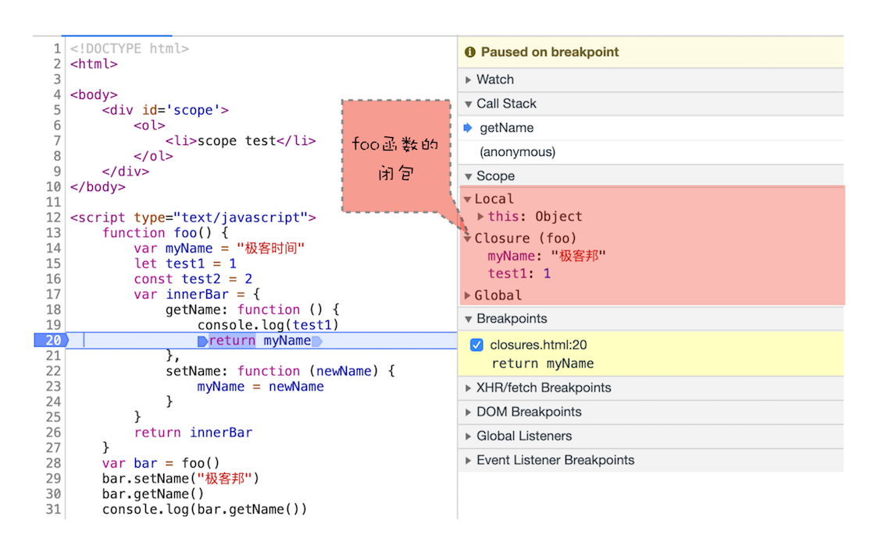

# 作用域链 和 闭包


先看代码，输出什么

```js
function bar() {
  console.log(myName) // 极客时间
}
function foo() {
  var myName = "极客邦"
  bar()
}
var myName = "极客时间"
foo()
```

尝试使用 调用栈、执行上下文 去分析


从图中可知，全局上下文 和 `foo` 函数的执行上下文 中都包含 `myName` 变量，那 `bar` 函数中打印的是哪一个呢？这其中的查找规则，就涉及到了 **作用域链** 。


## 作用域链

其实在每个 执行上下文 的 **变量环境** 中，都包含了一个 **外部引用** ，用来指向 外部 的 **执行上下文**，我们把这个外部引用称为 `outer` 。

变量查找 先在 当前执行上下文中 查找，找不到就继续沿着这个 外部引用 `outer` 往外查找，这个查找的链条就称为 **作用域链**。


由图可知， `foo` 函数 和 `bar` 函数的 `outer` 都指向了 全局执行上下文，在函数中未找到的变量， `js` 引擎 就会去全局执行上下文中查找。


虽然是 `foo` 函数中调用了 `bar` 函数，但 作用域链 与 函数调用 并没有什么关系，而是由 **词法作用域** 决定的。


### 词法作用域


- 词法作用域 就是指，作用域是由代码中 函数声明 的 **位置** 来决定的
- 词法作用域 是 **静态** 的作用域
- 词法作用域 是代码阶段就决定好的，和函数是怎么调用的没有关系
- 通过它就能够预测代码在执行过程中如何查找标识符


### 函数中的作用域链

看图理解 词法作用域 、 作用域链


- 词法作用域 就是根据代码的 位置 来决定的
- `JavaScript` 作用域链 是由 **词法作用域** 决定的
- 所以整个 词法作用域链 的顺序是： `foo` 函数作用域 -> `bar` 函数作用域 -> `main` 函数作用域 -> 全局作用域


### 块级作用域中的作用域链

观察以下代码，代码块中输出什么

```js
function bar() {
  var myName = "极客世界"
  let test1 = 100
  if (1) {
    let myName = "Chrome 浏览器"
    console.log(test) // 1
  }
}
function foo() {
  var myName = "极客邦"
  let test = 2
  {
    let test = 3
    bar()
  }
}
var myName = "极客时间"
let myAge = 10
let test = 1
foo()
```

尝试从 调用栈 和 词法环境 的角度去分析，变量会如何查找


查找顺序即 图上的 `1 -> 2 -> 3 -> 4 -> 5`


还是一样，变量查找规则与 函数调用栈 无关，而是与 **作用域链** 有关，即 **代码位置** 有关。


## 闭包

根据以下代码体会 闭包

```js
function foo() {
  var myName = "极客时间"
  let test1 = 1
  const test2 = 2
  var innerBar = {
    getName:function(){
      console.log(test1)
      return myName
    },
    setName:function(newName){
      myName = newName
    }
  }
  return innerBar
}
var bar = foo()
bar.setName("极客邦")
bar.getName()
console.log(bar.getName())
```

看看当执行到 `foo` 函数内部的 `return innerBar` 这行代码时调用栈的情况


返回的 `innerBar` 是 `foo` 函数的对象，且其中 `innerBar` 中的方法还使用了 `foo` 函数内的变量 `test1` 和 `myName`。

在 `foo` 函数调用结束后，此时的调用栈信息如下


虽然 `foo` 函数已经从栈顶弹出，但是由于返回的 `setName` 和 `getName` 方法中使用了 `foo` 函数内部的变量 `myName` 和 `test1` ，所以这两个变量依然保存在内存中。

这像极了 `setName` 和 `getName` 方法背的一个专属背包，无论在哪里调用了 `setName` 和 `getName` 方法，它们都会背着这个 `foo` 函数的专属背包。

之所以是专属背包，是因为除了 `setName` 和 `getName` 函数之外，其他任何地方都是无法访问该背包的，我们就可以把这个背包称为 `foo` 函数的闭包。


当调用 `setName` 和 `getName` 时候，函数中并没有 `myName` 变量， `js` 引擎是如何在存在闭包情况下查找变量的呢，可以查看下图


其顺序即： 当前执行上下文 -> `foo` 函数闭包 -> 全局执行上下文


开发者工具中调试如下




从图中可以看出来，当调用 `bar.getName` 的时候，右边 `Scope` 项就体现出了作用域链的情况：
- `Local` 就是当前的 `getName` 函数的作用域
- `Closure(foo)` 是指 `foo` 函数的闭包
- `Global` 就是指全局作用域
- 从 `Local -> Closure(foo) -> Global` 就是一个完整的作用域链


## 总结

- 通过 **作用域** 查找变量的链条称为 **作用域链**
- 作用域链 是通过 **词法作用域** 来确定，而 词法作用域 反映了代码的结构
- 块级作用域中的 作用域链 会先从 **词法环境** 中查找变量
- 闭包的形成是由于 函数内存在 引用 函数变量 的方法，导致函数内变量未能被回收，这些变量的集合 即 **闭包**


## Finally

观察以下代码是否会产生闭包，打印的是什么

```js
var bar = {
  myName: "time.geekbang.com",
  printName: function () {
    console.log(myName)
  }    
}
function foo() {
  let myName = "极客时间"
  return bar.printName
}
let myName = "极客邦"
let _printName = foo()
_printName()
bar.printName()
```

实际上打印的都是 “极客邦”，上面代码并没有形成闭包，第一次调用和第二次调用读取的都是 全局作用域 的变量，而非 `bar` 对象上的变量


或者尝试改成以下打印 `console.log(this.myName)` ， 再看看打印结果

```js
var bar = {
  myName: "time.geekbang.com",
  printName: function () {
    console.log(this.myName)
  }    
}
function foo() {
  let myName = "极客时间"
  return bar.printName
}
let myName = "极客邦"
let _printName = foo()
_printName() // undefined 因为 this 指向 window， let 声明的变量不会挂载到 window 上，var 则会
bar.printName() // time.geekbang.com 因为 this 指向 bar
```
