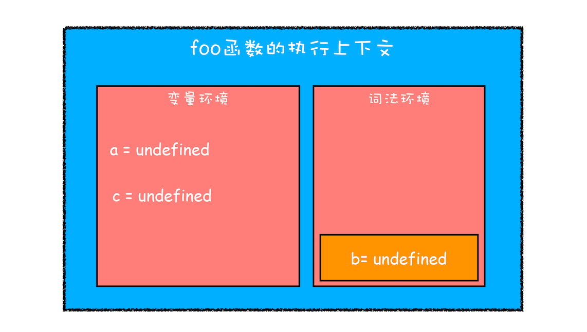
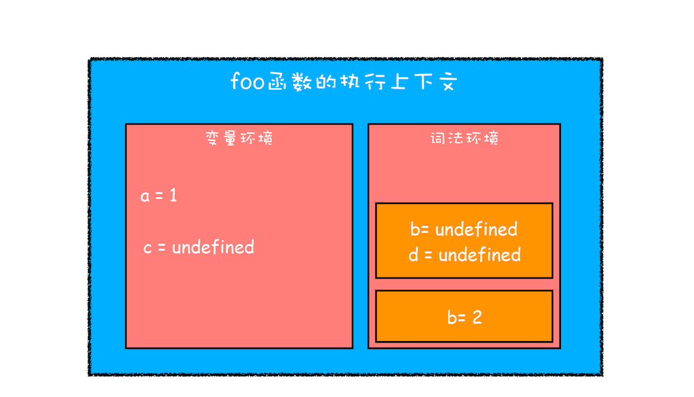
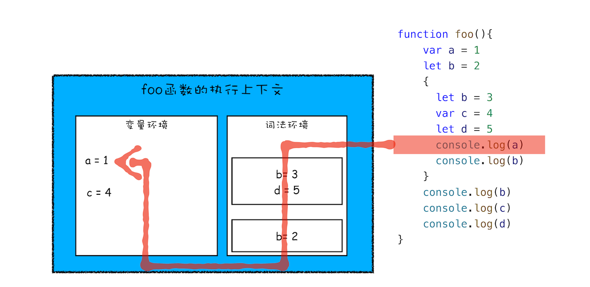
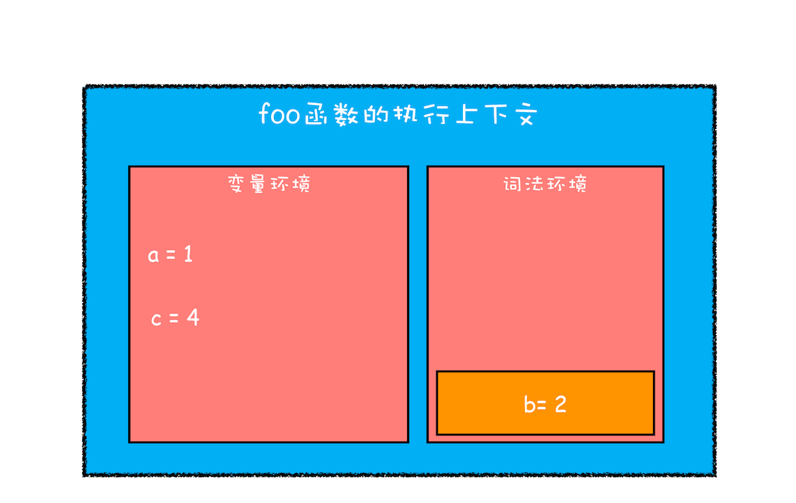

# 作用域


**作用域** 是指在程序中定义变量的区域，该位置决定了变量的生命周期。

通俗地理解，**作用域** 就是 变量 与 函数 的可访问范围，即 作用域 控制着变量和函数的 可见性 和 生命周期 。

`es6` 之前，只有两种作用域

- **全局作用域** - 跟随页面生成销毁，全局访问
- **函数作用域** - 跟随函数生成销毁，函数内访问

`js` 设计之初只是为了在网页中添加脚本做简单交互，并没有想到如今使用这么广泛，所以是怎么简单怎么设计，于是直接将变量提升到作用域顶部来，使其变量和函数在作用域中可以随地访问，既简单又快速，也没有块级作用域。


## 块级作用域

`es6` 中引进块级作用域，如以下代码，体会 块级作用域

```js
//if块
if(1){}

//while块
while(1){}

//函数块
function foo(){
 
//for循环块
for(let i = 0; i < 100; i++){}

//单独一个块
{}
```

块级作用域 通常由大括号 `{}` 包裹，其中变量和函数的生命周期跟随代码块使用、销毁。外部无法访问块级作用域中的变量和函数。


## 变量提升的隐患

观察以下例子，看下变量提升带来的隐患

```js
var myname = "极客时间"
function showName(){
  console.log(myname);
  // 然后把条件换成 true 试试，看看 myname 打印的都是什么
  if(false){
    var myname = "极客邦"
  }
  console.log(myname);
}
showName()
```

再如以下例子，变量提升，且没有块级作用域，导致外部仍能访问 `for` 代码块中的变量，同样令人疑惑

```js
function foo(){
  for (var i = 0; i < 7; i++) {}
  console.log(i); 
}
foo()
```


## let、const

`es6` 引入的 `let` 、 `const` 解决了变量提升问题，从而使 `js` 也有了块级作用域

```js
let x = 5
const y = 6
x = 7
y = 9 //报错，const声明的变量不可以修改
```

`let` 、 `const` 用于替代 `var` 声明变量，不会有变量提升，当然 `const` 声明的变量不可修改，指的是内存地址不可修改。


使用 `let` 或 `const` 对上一节的代码进行修改，重新打印试试，以下例子打印的都是外层变量

```js
const myname = "极客时间"
function showName(){
  console.log(myname); // 极客时间
  if(false){
    const myname = "极客邦"
  }
  console.log(myname); // 极客时间
}
showName()
```

以下例子会报错 `i` 未定义

```js
function foo(){
  for (let i = 0; i < 7; i++) {}
  console.log(i); 
}
foo()
```


## 块级作用域的执行上下文

`es6` 如何做到既支持 `var` 的变量提升，又支持 `let` 、 `const` 的块级作用域的呢？

根据以下例子代码，在 `foo()` 函数调用之前，会先进行编译，并对 `var` 声明的变量进行提升，但这里加入了 `let` ，会存在块级作用，看下块级作用域的变量在执行上下文中是如何保存的

```js
function foo(){
  var a = 1
  let b = 2
  {
    let b = 3
    var c = 4
    let d = 5
    console.log(a)
    console.log(b)
  }
  console.log(b) 
  console.log(c)
  console.log(d) // 注意 d 的声明位置，且是 let 声明的，其实这里会报错
}   
foo()
```

- **编译并创建执行上下文**，如图得出结论
  
  - 函数内部 `var` 声明的变量，编译阶段 全都被放到 **变量环境** 里面
  - `let` 声明的变量，编译阶段会被存放到 **词法环境** （ `Lexical Environment` ） 中
  - 函数内部的 块作用域 中的 `let` 声明的变量，并 没有 被放到 词法环境 中
  - **执行代码**，执行到函数内的 代码块 时，变量环境中的 `a` 赋值为 `1` ， 词法环境 中的 `b` 赋值为了 `2`


- 这时候函数的执行上下文就如下图所示：
  
  从图中可以看到，函数中的 代码块 中的 `let` 声明的变量，并没有 直接 存到函数的 词法环境 中，而是在词法环境内部维护了一个小型的 **栈结构** ，并将代码块中的 `let` 变量压入栈顶。
  
  代码块中的 `let` 变量的赋值、打印都先从代码块的 词法环境中 读取。

  **let 、 const 变量的查找顺序是，先从词法环境中栈顶向下查找，找不到再去变量环境中查找。**

  

  > 变量查找过程涉及到 **作用域链** 。

  函数中的 代码块 执行完毕后，就会从 **词法环境** 的 栈顶 弹出
  


以上便是该段代码的执行上下文分析过程，从中应该能理解变量环境和词法环境的结构和工作机制，两者的互相配合才使得 `es6` 既支持变量提升，又支持块级作用域。


## 总结

- **块级作用域** 就是通过 **词法环境** 的 **栈结构** 来实现的
- 而 变量提升 是通过 **变量环境** 来实现
- 通过这两者的结合， `JavaScript` 引擎也就同时支持了 变量提升 和 块级作用域 了


## Finlly

再看看以下代码，分析一下其中的词法环境

```js
let myname= '极客时间'
{
  console.log(myname) 
  let myname= '极客邦'
}
```

其实直接报错了

在 **块级作用域** 中（ 存在 `let` 、 `const` 声明的代码块 ），从开始到 `let` 代码之间，会形成一个 **暂时性死区** ，如果中间去访问 `myname` ， 会报初始化之前不能访问变量 `Uncaught ReferenceError: Cannot access 'myname' before initialization`

