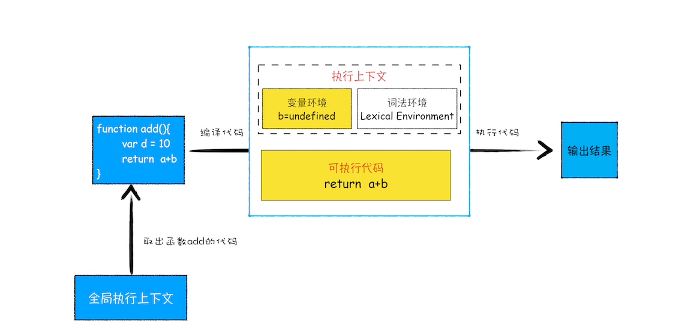
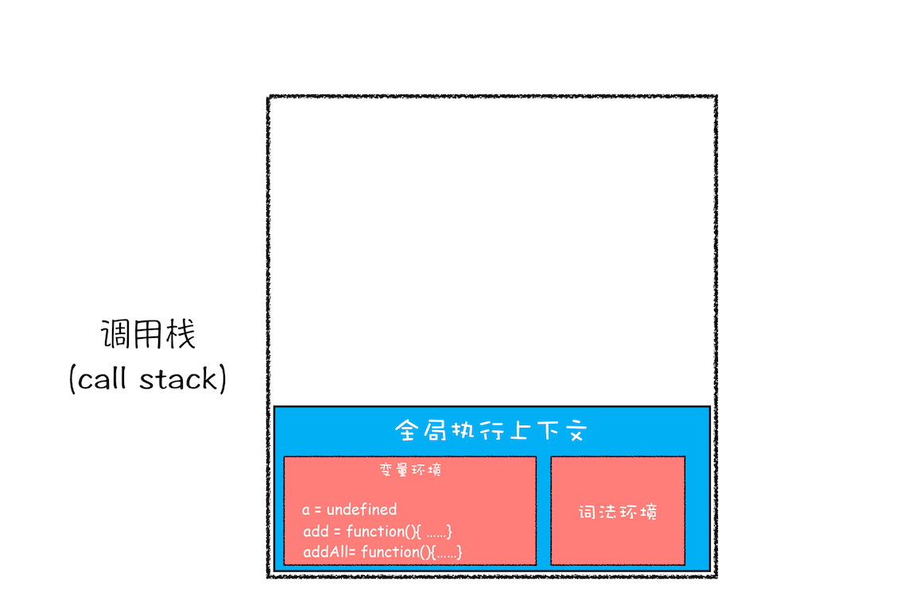
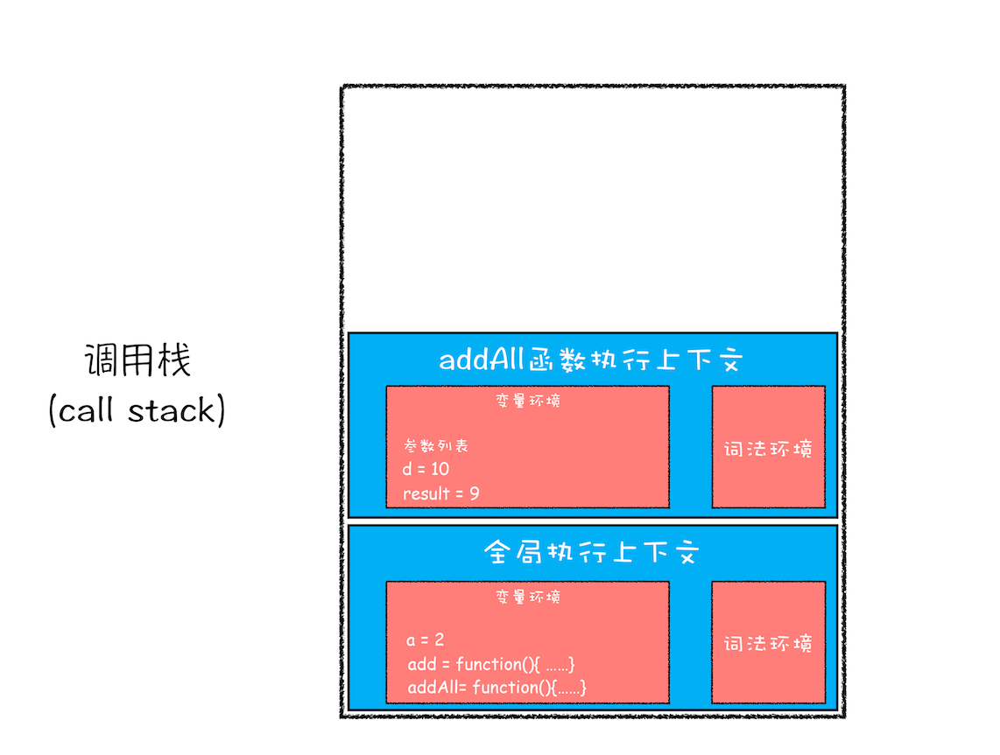
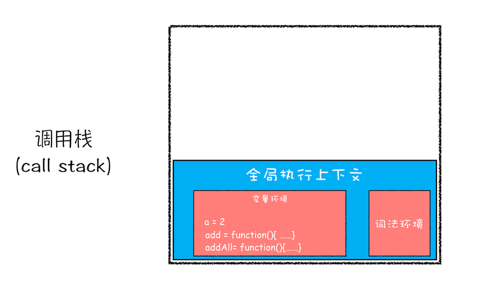

# JS 调用栈 和 栈溢出


什么样的代码才会在执行之前进入编译，并生成执行上下文，一般来说，有以下三种情况

- 当 `JavaScript` 执行全局代码的时候，会编译全局代码并创建全局执行上下文，而且在整个页面的生存周期内，全局执行上下文只有一份
- 当调用一个函数的时候，函数体内的代码会被编译，并创建函数执行上下文，一般情况下，函数执行结束之后，创建的函数执行上下文会被销毁
- 当使用 `eval` 函数的时候， `eval` 的代码也会被编译，并创建执行上下文


函数的执行上下文中储存了一个函数的信息，而且 函数 是可以调用另一个函数的，这个时候的执行上下文信息该如何保存呢？这就是调用栈的功能。

**调用栈就是用来管理函数调用关系的一种数据结构。**


## 函数调用

根据以下例子理解函数调用时的执行上下文创建过程

```js
var a = 2
function add(){
  var b = 10
  return  a+b
}
add()
```

- 编译代码，创建全局执行上下文，其中的变量环境对象中包含了声明的变量和函数，如下图
  

- 执行代码，开始执行全局代码，执行到 `add()` 这里， `js` 引擎会之别到这是一个函数调用，随即开始编译 `add` 函数内部代码
  - 从全局上下文中取出 `add` 函数代码
  - 编译 `add` 函数代码，并创建函数的 执行上下文 和 可执行代码
  - 最后执行代码


完整流程如下（ `js` 是边解释边执行的语言 ）




至此，我们能直观的看到并理解，执行到 `add` 函数的时候会存在两个执行上下文，而管理这些执行上下文的就是**调用栈**


## js 调用栈


**栈** 是一种 **先进后出** 的一种数据结构， **调用栈** 也是如此。


根据以下代码理解 `js` 调用栈

```js
var a = 2
function add(b, c){
  return b + c
}
function addAll(b, c){
  var d = 10
  result = add(b, c)
  return a + result + d
}
addAll(3, 6)
```

- 创建全局上下文，压入栈底，变量环境对象中保存的信息如图所示
  
- 执行全局代码，赋值 `a = 2`
  
- 调用 `addAll` 函数，但会先进行编译，生成 `addAll` 函数的执行上下文，并压入调用栈
  
- 执行 `addAll` 函数代码，赋值 `d = 10` ，执行到 `add` 函数，同样要编译，为 `add` 函数创建执行上下文，并压入栈中
  
- 执行 `add` 函数完毕后，会将 `add` 函数的执行上下文从栈顶中弹出，并将结果赋值给 `result = 9`
  
- 继续执行 `addAll` 函数代码， `return` 后同样需要将 `addAll` 的执行上下文出栈，此时只剩下全局执行上下文
  


至此，整个 `js` 执行流程结束

**调用栈** 是 `JavaScript` 引擎追踪函数执行的一个机制，当一次有多个函数被调用时，通过调用栈就能够追踪到哪个函数正在被执行以及各函数之间的调用关系。


## 开发时查看调用栈

- 浏览器查看调用栈 - 添加 `debugger` 断点后查看 -> `Call Stack` ， 最底下的 `(anonymous)` 是全局函数入口
  
- `console.trace()`
  


## 栈溢出 Stack Overflow

**调用栈 是有大小的** ， 超过一定数量 `js` 引擎 就会报 **栈溢出** 错误（ `Maximum call stack size exceeded` ）。特别是在写递归代码的时候。

```js
// Maximum call stack size exceeded
function division(a,b){
  return division(a,b)
}
console.log(division(1,2))
```

所以必须采取一些方法来避免栈溢出错误，比如

- 收紧递归终止条件，防止递归次数过多
- 尾递归优化，文章可见[尾调用、尾递归 优化](./tail-call.md)


## 总结

- 每调用一个函数，`JavaScript` 引擎会为其创建执行上下文，并把该执行上下文压入调用栈，然后 `JavaScript` 引擎开始执行函数代码。
- 如果在一个函数 `A` 中调用了另外一个函数 `B` ，那么 `JavaScript` 引擎会为 `B` 函数创建执行上下文，并将 `B` 函数的执行上下文压入栈顶。
- 当前函数执行完毕后，`JavaScript` 引擎会将该函数的执行上下文弹出栈。
- 当分配的调用栈空间被占满时，会引发 **堆栈溢出** 问题。
- 栈是一种非常重要的数据结构，不光应用在 `JavaScript` 语言中，其他的编程语言，如 `C/C++` 、 `Java` 、 `Python` 等语言，在执行过程中也都使用了栈来管理函数之间的调用关系。所以栈是非常基础且重要的知识点，必须得掌握。


## Finally

有如下递归函数，会递归 `n` 次，当输入一个较大的数时，就会栈溢出，请进行优化

```js
function runStack (n) {
  if (n === 0) return 100;
  return runStack(n - 2);
}
runStack(50000)
```


可修改成循环

```js
// 优化
function runStack(n) {
  while (true) {
    if (n === 0) {
      return 100;
    }
    if (n === 1) { // 防止陷入死循环
      return 200;
    }
    n = n - 2;
  }
}

console.log(runStack(50000));
```