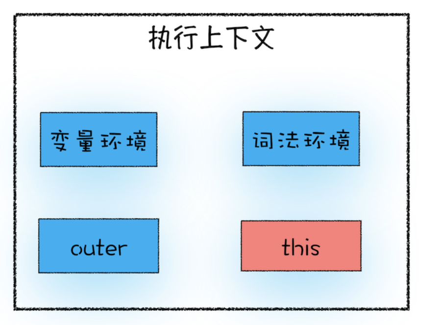

# This：从 JS 执行上下文视角讲 This


前面我们已经知道 `JavaScript` 语言的 **作用域链** 是由 **词法作用域** 决定的，而 **词法作用域** 是由 **代码结构** 来确定的。

但是如何在 对象内部 使用 对象内部的变量 呢？比如上一节例子中的 `myName`

```js
var bar = {
  myName: 'lafen',
  getName: function() {
    console.log(myName) // 期望拿到的是 lafen
  }
}
console.log(bar.getName())
```

这时， `js` 又搞出了一套 `this` 机制来支持这个需求。即添加 `this` 去访问即可

```js
getName: function() {
  console.log(this.myName)
}
```

此时，你应该要注意区分，**作用域链 和 this 是两套不同的系统，两者没有太大的联系。**


## this 是什么

关于 `this` ， 还得从 **执行上下文** 说起，执行上下文中，其实还包含了 `this` ， 执行上下文中 应包含

- 变量环境
- 词法环境
- `outer`
- **this**



`this` 是和 **执行上下文** 绑定的，也就是说每一个执行上下文中，都有一个 `this` 。即有如下 `3` 种执行上下文 和 `this` 的对应关系

- 全局执行上下文 - 全局 `this`
- 函数执行上下文 - 函数 `this`
- `eval` 执行上下文 - `eval` 的 `this`


### 全局执行上下文中的 this

众所周知 ， 全局 `this` 指向的是 `window` 对象


### 函数执行上下文中的 this

先看下函数中的 `this` 是谁

```js
function foo(){
  console.log(this) // window
}
foo()
```

说明普通函数调用时，函数内的 `this` 也是指向 `window` ， 如果想更改，可以使用以下方式


#### 通过 call 修改 this 指向

观察以下代码，尝试打印试试

```js
let bar = {
  myName : "极客邦",
  test1 : 1
}
function foo(){
  this.myName = "极客时间"
}
foo.call(bar)
console.log(bar)
console.log(myName)
```

- `foo` 函数通过 `call` 来调用，并传入了 `bar` 对象，改变了 `foo` 函数内部的 `this` 指向 `bar`
- 打印 `bar` 发现其中的 `bar.myName` 已经被修改


此外还有 `apply` 和 `bind` 也是修改可以修改 `this` 指向的方法。


#### 通过对象调用方法设置

```js
var myObj = {
  name : "极客时间", 
  showThis: function(){
    console.log(this)
  }
}
// 通过对象调用方法， this 指向对象
myObj.showThis()
```

但注意区别以下代码，全局中调用函数， `this` 指向又会变成 `window`

```js
var myObj = {
  name : "极客时间", 
  showThis: function(){
    console.log(this)
  }
}

const show = myObj.showThis
show() // this 指向 window
```


#### 通过构造函数设置

```js
function CreateObj(){
  this.name = "极客时间"
}
var myObj = new CreateObj()
```

`new` 一个对象时，可以看作 `js` 引擎处理如下

- 首先创建了一个空对象 `tempObj`
- 接着调用 `CreateObj.call` 方法，并将 `tempObj` 作为 `call` 方法的参数，这样当 `CreateObj` 的执行上下文创建时，它的 `this` 就指向了 `tempObj` 对象
- 然后执行 `CreateObj` 函数，此时的 `CreateObj` 函数执行上下文中的 `this` 指向了 `tempObj` 对象
- 最后返回 `tempObj` 对象


此时，构造函数中的 `this` 指向的是新创建出来的实例对象


### this 缺陷

`js` 中的 `this` 实际上非常反直觉


#### 嵌套函数中的 this 不会从外层函数中继承

看以下代码

```js
var myObj = {
  name : "极客时间", 
  showThis: function() {
    console.log(this)
    function bar() {
      console.log(this)
    }
    bar()
  }
}
myObj.showThis()
```

按直觉来说， `bar()` 函数中的 `this` 应该和 `showThis()` 函数中的 `this` 一致，都指向 `myObj` 才对，但是实际上却是

- `showThis()` 中指向的是 `myObj`
- `bar()` 中指向的是 `window`


想解决上面 `bar()` 中的 `this` 的反直觉指向问题，可以通过保存一下 `this` 来解决，本质上是将 `this` 体系，转换成 **作用域** 体系

```js
var myObj = {
  name : "极客时间", 
  showThis: function() {
    console.log(this)
    var self = this
    function bar() {
      self.name = "极客邦"
    }
    bar()
  }
}
myObj.showThis()
console.log(myObj.name)
console.log(window.name)
```

或者，使用 `es6` 的箭头函数来解决

```js
var myObj = {
  name : "极客时间", 
  showThis: function(){
    console.log(this)
    var bar = () => {
      this.name = "极客邦"
      console.log(this)
    }
    bar()
  }
}
myObj.showThis()
console.log(myObj.name)
console.log(window.name)
```

这是因为 `ES6` 中的 箭头函数 **并不会** 创建其自身的 执行上下文 ，所以 **箭头函数** 中的 `this` 取决于它的 **外部非箭头函数**。

所以，解决 嵌套函数中的 `this` 不会从外层函数中继承 的问题，我们有两种方式

- 第一种是把 `this` 保存为一个 `self` 变量，再利用变量的作用域机制传递给嵌套函数
- 第二种是继续使用 `this` ，但是要把嵌套函数改为 **箭头函数** ，因为箭头函数 没有 自己的 执行上下文 ，所以它会继承调用函数中的 `this`


#### 普通函数中的 this 默认指向全局对象 window

实际工作中，我们并不希望函数执行上下文中的 `this` 默认指向 **全局对象** ，因为这样会打破数据的边界，造成一些误操作。

如果要让函数执行上下文中的 `this` 指向某个对象，最好的方式是通过 `call` 、 `apply` 、 `bind` 方法来显示调用。

这个问题也可以通过设置 `JavaScript` 的 **严格模式** 来解决。在严格模式下，默认执行一个函数，其函数的执行上下文中的 `this` 值是 `undefined` ，这就解决上面的问题了。


## 总结

- 构造函数的 `this` 指向 `new` 创建的新对象
- 通过对象调用方法， `this` 指向该对象
- 函数正常调用时，严格模式下 `this` 指向 `undefined` ， 非严格模式下 `this` 指向 `window`
- 嵌套函数中的 `this` 不会继承外层函数的 `this`
- 箭头函数没有自己的执行上下文，所以箭头函数的 `this` 就是它外层非箭头函数的 `this`

