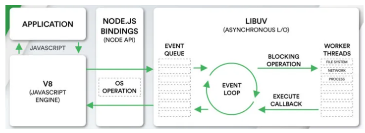

# Node Event Loop


## Node 事件循环

浏览器中事件循环根据 `HTML5` 定义的规范来实现， `node` 中则是基于 `libuv` 实现， `libuv` 是一个跨平台的专注于异步 `IO` 的库



上图 `EVENT_QUEUE` 给人看起来只有一个队列，但 `EventLoop` 存在 `6` 个阶段，每个阶段都有对应的一个先进先出的回调队列


## 循环流程

`node` 中事件循环分成以下六个阶段


- `timers` ，执行 `setTimeout` 、 `setInterval` 的回调
- `I/O callbacks` ， 执行延迟到下一个循环迭代的 `I/O` 回调，即上一轮循环中未被执行的一些 `I/O` 回调
- `idle，prepare` ， 闲置阶段，仅系统内部使用
- `poll` ， 轮询阶段，检索新的 `I/O` 事件，执行与 `I/O` 相关的回调， `node` 将在适当的时候在此阻塞
- `check` ， 检查阶段， `setImmediate` 回调函数在此执行
- `close callbacks` ， 关闭事件回调，如 `socket.on('close', () => {})`


每个阶段对应一个队列，当事件循环进入某个阶段时，将在该阶段内执行回调，直到队列耗尽或者回调的最大数量已执行，那就进行下一个处理阶段


## process.nextTick

除了上述 `6` 个阶段，还有 `process.nextTick` ，他不属于事件循环中的任何一个阶段，他属于该阶段与下阶段之间的过渡，即本阶段执行结束，进入下一个阶段前，所要执行的回调，类似插队


## 微任务和宏任务

在 `node` 中，同样有宏任务与微任务的概念，与浏览器中的事件循环相似


微任务对应有

- `process.nextTick`
- `Promise.then` 、 `queueMicrotask`


宏任务对应有

- `timers` ： `setTimeout` 、 `setInterval`
- `poll queue` ： `I/O` 事件
- `check queue` ： `setImmediate`
- `close queue` ： `close` 事件


其执行顺序为以此先微任务，后宏任务


## 常见题目

```js
async function async1() {
  console.log('async1 start')
  await async2()
  console.log('async1 end')
}

async function async2() {
  console.log('async2')
}

console.log('script start')

setTimeout(function () {
  console.log('setTimeout0')
}, 0)

setTimeout(function () {
  console.log('setTimeout2')
}, 300)

setImmediate(() => console.log('setImmediate'));

process.nextTick(() => console.log('nextTick1'));

async1();

process.nextTick(() => console.log('nextTick2'));

new Promise(function (resolve) {
  console.log('promise1')
  resolve();
  console.log('promise2')
}).then(function () {
  console.log('promise3')
})

console.log('script end')
```


**分析过程**

- 先找到同步任务，输出 `script start`
- 遇到第一个 `setTimeout`，将里面的回调函数放到 `timer` 队列中
- 遇到第二个 `setTimeout`，`300ms` 后将里面的回调函数放到 `timer` 队列中
- 遇到第一个 `setImmediate` ，将里面的回调函数放到 `check` 队列中
- 遇到第一个 `nextTick` ，将其里面的回调函数放到本轮同步任务执行完毕后执行
- 执行 `async1` 函数，输出 `async1 start`
- 执行 `async2` 函数，输出 `async2`，`async2` 后面的输出 `async1 end` 进入微任务，等待下一轮的事件循环
- 遇到第二个 `nextTick` ，将其里面的回调函数放到本轮同步任务执行完毕后执行
- 遇到 `new Promise`，执行里面的立即执行函数，输出 `promise1`、`promise2`
- `then` 里面的回调函数进入微任务队列
- 遇到同步任务，输出 `script end`
- 执行下一轮回调函数，先依次输出 `nextTick` 的函数，分别是 `nextTick1`、`nextTick2`
- 然后执行微任务队列，依次输出 `async1 end`、`promise3`
- 执行 `timer` 队列，依次输出 `setTimeout0`
- 接着执行 `check` 队列，依次输出 `setImmediate`
- `300ms` 后， `timer` 队列存在任务，执行输出 `setTimeout2`


**执行结果**

```js
script start
async1 start
async2
promise1
promise2
script end
nextTick1
nextTick2
async1 end
promise3
setTimeout0
setImmediate
setTimeout2
```


再如以下题目

> 理解 process.nextTick 的优先级，还有 Promise.then 以及 setTimeout 和 setImmediate

```js
setImmediate(() => {
  console.log('setImmediate')
})
setTimeout(() => {
  console.log('setTimeout1111')
  setTimeout(() => {
    console.log('setTimeout4444')
  })
  process.nextTick(() => {
    console.log('setTimeout-nextTick')
  })
})
setTimeout(() => {
  console.log('setTimeout3333')
})
process.nextTick(()=> {
  console.log('nextTick-outer')
  new Promise((resolve) => {
    console.log('promise')
    resolve()
  }).then(res => {
    console.log('promise-then')
  })
  process.nextTick(() => {
    console.log('nextTick-inner')
  })
})
process.nextTick(() => {
  console.log('nextTick-2222')
})
setTimeout(() => {
  console.log('setTimeout2222')
})
```

**输出结果**

```js
nextTick-outer
promise
nextTick-2222
nextTick-inner
promise-then
setTimeout1111
setTimeout-nextTick
setTimeout3333
setTimeout2222
setImmediate
setTimeout4444
```
