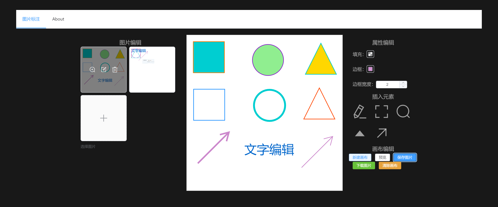

# fabric-editor


`canvas api` 晦涩难用，使用 `fabric` 做一个画布编辑器

基本样式如下




## 功能

- 左侧图片编辑、预览、删除
- 中间画布插入、选中、编辑元素
- 右侧对选中元素属性编辑，提供新建、预览、下载画布等功能


## 开发

本文对应代码使用 `vue3` 做示例，详见 [fabric-editor-demo](https://gitee.com/lafen/fabric-editor-demo)

### 初始化画布

下载依赖 fabric 并初始化画布

```vue
<script setup>
import { fabric } from 'fabric'

const canvasRef = ref(null)

const bg = 'rgba(255, 255, 255, 1)'

const init = () => {
  canvasRef.value = new fabric.Canvas('c')
  canvasRef.value.backgroundColor = bg
}
onMounted(init)
</script>

<template>
  <canvas id="c" width="500" height="500"></canvas>
</template>
```


### 插入元素

`fabric` 提供文本、矩形、圆形等多种图形创建方法，并通过 `add` 的方式将图形渲染到画布上

```js
// 基础配置
const config = {
  fill : '#0066ccff',
  stroke: '#8822cc00',
  left: 20,
  top: 20
}
// 生成文本
const tShape = new fabric.IText('Fabric-Editor', {
  ...config,
  text: '文字编辑',
  strokeWidth: 0,
  left: 20,
  top: 20
})

// 生成矩形、圆形
const type = ['Rect', 'Circle']
const shape = new fabric[type]({
  ...config,
  width : 100, // 矩形宽
  height : 100, // 矩形高
  fill : '#cc226600',
  stroke: '#cc2266ff',
  strokeWidth: 2,
  radius : 50 // 圆形半径
})

// 渲染到画布
canvasRef.value.add(shape)
// 设置选中
cavasRef.value.setActiveObject(shape)
```


### 编辑元素属性

选中元素时，可以对元素属性进行编辑，例如 填充色、边框色、边框宽。

首先选中元素时，先获取元素的属性回显，于是监听画布的 `mouse:down` 事件

```vue
<script setup>
// 元素属性
const attrs = ref({
  fill: '',
  stroke: '',
  strokeWidth: 0
})
// 监听画布的 mouse:down 事件
canvasRef.value.on('mouse:down', (e) => {
  if (e.target) {
    const { fill = '#0066cc', stroke = '', strokeWidth = 0 } = e.target
    attrs.value = { fill, stroke, strokeWidth }
    canvasRef.value.renderAll()
  }
})

// 修改元素属性
const updateAttr = (type, value) => {
  attrs.value[type] = value
  const activeObj = canvasRef.value.getActiveObject()
  if (activeObj) {
    activeObj.set({ ...attrs.value })
    canvasRef.value.renderAll()
  }
}

<template>
  <el-color-picker
    v-model="attrs.fill"
    show-alpha
    :predefine="predefineColors"
    @change="val => updateAttr('fill', val)"
  />
</template>
</script>
```


### 画布导出

可以通过 `toDataURL` 方法将画布转换为 `base64` 图片进行预览或下载

```js
// 下载
const download = (url, name) => {
  return fetch(url).then(res => res.blob().then(blob => {
    let a = document.createElement('a')
    let url = window.URL.createObjectURL(blob)
    a.href = url
    a.download = filename
    a.click()
    window.URL.revokeObjectURL(url)
  }))
}

// 获取 url
const getImgUrl = () => {
  // 取消画布元素选中
  canvasRef.value.discardActiveObject()
  canvasRef.value.renderAll()
  const ele = document.getElementById('c')
  const url = ele.toDataURL('image/png')
  return url
}

// 画布导出图片
const handleDownload = () => {
  const url = getImgUrl()
  download(url, `fabric-editor-${nanoid(8)}.png`)
}
```

### 画布转 json 储存

将画布以 `json` 格式储存，方便下次加载画布来进行编辑

```js
// 获取画布 json
const getDataJson = () => {
  const id = nanoid(8)
  const json = canvasRef.value.toDatalessJSON()
  const url = getImgUrl()
  // 保存 id、图片 和 画布 json 数据
  const data = { id, url, json }
  return data
}

// 通过 json 渲染画布回显
const setDataJson = (data) => {
  canvasRef.value.loadFromJSON(data.json, canvasRef.value.renderAll.bind(canvasRef.value))
}
```


## Finally

- [fabric-editor-demo](https://gitee.com/lafen/fabric-editor-demo)
- [fabricjs 官网](http://fabricjs.com/)
- [fabricjs 官网 demo](http://fabricjs.com/demos/)
