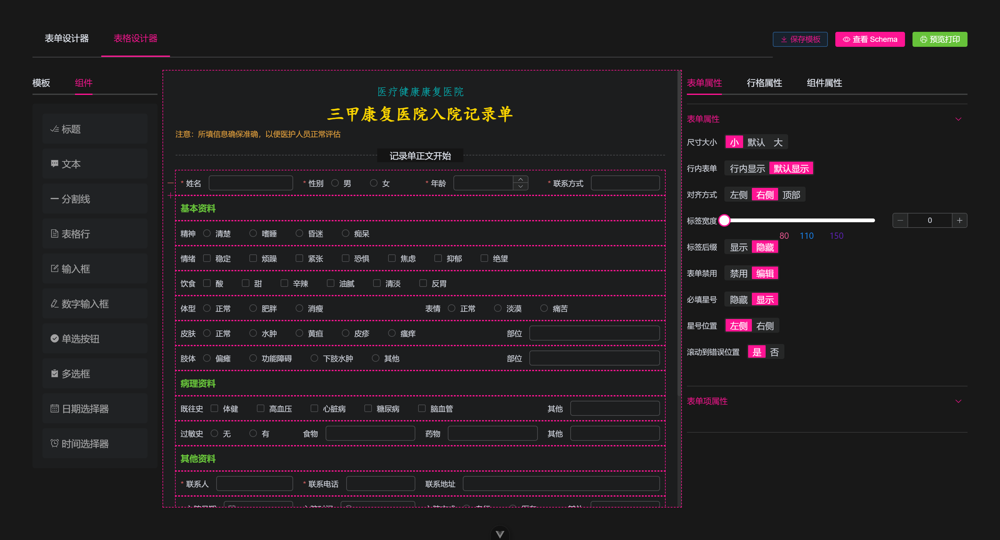

# Form Design


利用 `vue-draggable-plus` 实现一个表单设计器，本文提供一个实现思路，以及示例 `Demo` ，详见 [vue-form-generator](https://gitee.com/lafen/vue-form-generator)


常见的应用场景有如下

- 快速生成特殊表单表格以供 **打印** 使用
- 也可以作为快速表单设计器使用


## 主要功能

- 支持常见表单组件拖拽放置、排序、编辑等功能
- 保存、编辑、删除模板
- `Json Schema` 复制、编辑生成表单，可 预览并 下载 打印表单




## 开发


本项目使用 `vite + vue3.5` 完成，以下是开发过程中大致遇到的配置和相应的依赖包

- `vue + element-plus` 全家桶
- `unocss` 不用写太多的 `css` 了
- `vue-draggable-plus` 拖拽组件支持
- `vue-codemirror` 代码编辑器
- `vue-clipboard3` 代码复制
- `html2canvas` 生成图片下载
- `nanoid` 简易生成唯一 `id`
- `unplugin-auto-import` 开发环境自动引入 `vue` 全家桶 等 `api`
- `unplugin-icons` 开发环境自动引入 `@element/icons-vue` 图标
- `unplugin-vue-components` 开发环境自动引入 `element-plus` 组件
- `vite-plugin-style-import` 开发环境自动引入 `element-plus` 的 `api` 和 组件样式


### 主要思路


- 约定组件的描述配置 `Json Schema` ，由 `json` 来描述如何生成一个组件
- 根据 `json` 来遍历渲染组件，并生成对应的组件编辑器
- 组件的属性编辑也同样使用 `json` 来描述，遍历生成组件属性的编辑
- 使用 `el-form` 包裹统一配置，使用 `el-row` 方便实现栅栏布局
- 拖拽组件到另一个列表使用 `vue-draggable-plus` 需要配置 `group`
- 其他的 `json` 复制编辑、打印下载等功能则借助 `codemirror` 等来完成即可


### Json 数据约定


`Json` 约定包括 页面表单渲染数据定义 `schema` ，左侧组件属性预定义 `tagList`  ，右侧的表单属性则来自 `tagList` 和 `schema`


#### tagList 数据


左侧 **表单组件** 列表 `tagList` ，可以定义渲染的组件类型 `type` ，和对应的 `props` 属性

另外 组件是 包裹在 `el-col > el-form-item` 中的，所以在这里定义 `el-col` 和 `el-form-item` 属性

```js
const tagList = [
  {
    id: 'input', // 组件唯一标识，拖拽时生成的组件唯一 id
    type: 'input', // 组件类型 element-plus 的 el-input
    label: '文本框', // 显示的组件名
    icon: 'Edit', // 显示的 @element-plus/icons-vue 图标
    // 以下属性会作用到组件和包裹组件上
    field: 'input', // 表单字段名
    props: {}, // 预定义的 el-input 组件属性
    col: { span: 12 }, // 栅栏布局属性
    formItemProps: { label: '文本框' }, // 表单属性
  },
]
```


左侧面板直接遍历组件列表，以供拖拽到中间，这里使用 `VueDraggable` 组件实现，默认第一层子组件即为可拖拽

```vue
<script setup>
import { VueDraggable } from 'vue-draggable-plus'
</script>

<template>
  <VueDraggable
    v-model="tagList"
    animation="150"
    :group="group"
    :sort="false"
    :clone="customeClone"
  >
    <div
      v-for="item of tagList"
      :key="item.type"
    >
      <el-icon>
        <component :is="item.icon ?? 'Plus'" />
      </el-icon>
      <span>{{ item.label }}</span>
    </div>
  </VueDraggable>
</template>
```

注意不同列表间拖拽需要同名的 `group.name` ， 而且拖拽复制时需要生成唯一 `id` 和 `field` 字段

```vue
<script setup>
// 不同列表之间拖拽需要配置相同的 group.name 属性
const group = readonly({
  name: 'tableContainer', // 两个列表间拖拽需要同名
  pull: 'clone', // 拖拽行为为 复制
  put: false, // 禁止放置
})

// 自定义复制，生成 唯一 id 和 field
const customeClone = item => {
  return {
    ...cloneDeep(item),
    id: `${item.type}-${nanoid(4)}`,
    field: `${item.type}-${nanoid(4)}`,
  }
}
</script>
```

以上示例是 `input` 组件的配置，其他组件配置类似，可以根据需要自行添加

另外组件是放置在 `el-row` 组件中的，所以 `el-row` 也支持拖拽放置，也作为组件定义

```js
const tagList = [
  {
    // input...
  },
  {
    type: 'row',
    label: '栅栏',
    field: 'row',
    icon: 'Document',
    id: '',
    children: [], // 一行的组件将被放置在此，例如 input
    props: { style: { minHeight: 40 } }, // 栅栏属性
  },
]
```


#### schema 数据


页面渲染的表单数据，需要包含 `form` **属性** 和 **字段**，以及组件描述列表 `fieldList` ， `fieldList` 就是由 `tagList` 中复制过来的组件描述

```vue
<script setup>
const schema = ref({
  id: nanoid(8),
  name: '表单名',
  data: {}, // 表单字段
  formProps: {}, // 表单属性
  fieldList: [], // 组件描述列表
})
</script>
```

注意这里只定义了 `formProps` 属性，因为组件层级为 `el-form > el-row > el-col > el-form-item > el-input` ，所以这里将 `formProps` 放到最外层，方便统一配置


基于这个层级，通过遍历生成对应的表单，生成表单属性编辑器，这里使用 `el-form` 包裹统一配置，使用 `el-row` 方便实现栅栏布局

```vue
<script setup>
// 指令使用方式
import { vDraggable } from 'vue-draggable-plus'
import RenderInput from './widgets/input.vue'
import RenderRow from './widgets/row.vue'

const dragOption = { animation: 150, group: group.name }
// 栅格里显示的组件
const componentMap = {
  input: RenderInput,
  row: RenderRow,
}
</script>

<template>
  <el-form
    :model="schema.data"
    v-bind="schema.formProps"
    v-draggable="[schema.fieldList, dragOption]"
  >
    <template v-for="item of schema.fieldList" :key="item.id">
      <!-- row 中的表单组件 -->
      <template v-if="item.type === 'row'">
        <el-row
          v-bind="item.props"
          v-draggable="[item.children, dragOption]"
        >
          <el-col v-for="child of item.children" :key="child.id" v-bind="child.colProps">
            <el-form-item v-bind="child.formItemProps">
              <component :is="componentMap[child.type]" :field="child" />
            </el-form-item>
          </el-col>
        </el-row>
      </template>
      <template v-else>
        <!-- 不在 row 中的组件，例如 row -->
        <component :is="componentMap[item.type]" :field="item" />
      </template>
    </template>
  </el-form>
</template>
```

这里的拖拽组件使用了 指令方式，至于 `RenderInput` ，实际上也是 `el-input` 组件，只是封装了一层绑定一些属性，方便使用，其他组件也类似

```vue
<script setup>
import { provideTableKey } from './hooks/use-provide-key'

// 由父辈组件通过 provideTableKey 来 provide 提供给表单组件使用
const { schema } = inject(provideTableKey)
const { field } = defineProps({ field: Object })

defineOptions({ name: 'RenderInput' })
</script>
<template>
  <el-input v-model="schema.data[field.field]" v-bind="field.props" />
</template>
```

不出意外，上述代码应该就能实现我们想要的效果了，能够正常拖拽放置、渲染表单了


#### 表单和组件属性数据


右侧的表单、栅栏、组件属性，都是来自于 `schema` ，在点击栅栏和组件时，需要记录当前点击的是哪个组件 `currentItem` ，哪个栅栏 `currentRow` ，其对应关系如下

- `schema.formProps` 表单属性
- `schema.fieldList[index]`
  - `currentItem.formItemProps` 表单项属性
  - `currentItem.colProps / currentRow.props` 栅栏属性
  - `currentItem.props` 组件属性


表单、表单项属性 根据 `el-form` 和 `el-form-item` 文档属性来定义编辑的组件，同样根据 `json` 来定义渲染，示例如下

```js
// el-form 的 props 属性
export const formPropsList = [
  {
    field: 'size', // size 属性
    label: '尺寸大小', // 表单项的 label
    component: 'ElSegmented', // size 属性的编辑组件
    props: { options: ['small', 'default', 'large'] }, // 传递给 ElSegmented 的 props
  },
  // 其他属性类似如上定义...
]

// el-form-item 的 props 属性
export const formItemPropsList = [
  {
    field: 'label',
    label: '标签文本',
    component: 'ElInput',
    props: {},
  },
  // 其他属性类似如上定义...
]
```

对应页面渲染如下，例如 `el-form` 的属性渲染

```vue
<template>
  <el-form :model="schema.formProps">
    <template
      v-for="(item, index) of formPropsList"
      :key="index"
    >
      <el-form-item :label="item.label">
        <component
          :is="item.component"
          v-model="schema.formProps[item.field]"
          v-bind="item.props"
        />
      </el-form-item>
    </template>
  </el-form>
</template>
```

而 `el-form-item` 属性 也类似这样遍历绑定编辑

```vue
<template>
  <el-form
    v-if="currentItem.formItemProps"
    :model="currentItem.formItemProps"
  >
    <el-form-item label="绑定字段">
      <el-input v-model="currentItem.field" />
    </el-form-item>
    <template
      v-for="(item, index) of formItemPropsList"
      :key="index"
    >
      <el-form-item :label="item.label">
        <component
          :is="item.component"
          v-model="currentItem.formItemProps[item.field]"
          v-bind="item.props"
        />
      </el-form-item>
    </template>
  </el-form>
</template>
```

那 `el-row` 和 `el-col` 的属性编辑基本也是如此实现的，这里就不再赘述


麻烦的是 各种表单组件的属性配置，每一个表单组件都得一一定义它们对应的 `props` 属性，例如常见的 `input` 组件

```js
export const componentPropsMap = {
  input: [
    {
      field: 'placeholder', // 属性对应字段名
      label: '占位符', // 表单项标签
      component: 'ElInput', // 使用 input 来编辑
      props: {}, // 传给 input 的 props
    },
    {
      field: 'clearable',
      label: '是否可清空',
      component: 'ElSwitch',
      props: { activeText: '是', inactiveText: '否' }
    },
    // el-input 的其他 props 属性...
  ],
  // 其他 组件的 props 属性...
}
```

这样就可以根据当前选中的是哪个组件，来获取其对应的所有 `props` 属性来编辑了


### schema 查看、复制

页面中显示 `schema` 编辑 和 复制 都可以使用依赖包来完成，使用到以下 `npm` 包

- `vue-codemirror` 支持 `vue3` 的代码编辑器，注意还需要 `codemirror` 核心包
- `@codemirror/lang-json` 语言包支持 `json` 显示编辑
- `@codemirror/theme-one-dark` 暗色主题包，可不需要
- `vue-clipboard3` 复制代码到剪切板，支持 `vue3`


```vue
<script setup>
import { Codemirror } from 'vue-codemirror'
import { json } from '@codemirror/lang-json'
import { oneDark } from '@codemirror/theme-one-dark'
import useClipboard from 'vue-clipboard3'

const { toClipboard } = useClipboard()
const extensions = [json(), oneDark]

// 获取 schema 转换为字符串
const codeStr = ref('')
const getSchemaCodeStr = () => {
  codeStr.value = JSON.stringify(schema.value, null, 2)
}
onMounted(getSchemaCodeStr)
// 一键复制 schema
const handleCoopy = async () => {
  await toClipboard(codeStr.value)
}
</script>

<template>
  <Codemirror
    v-model="codeStr"
    :extensions="extensions"
    :tab-size="2"
    indent-with-tab
  />

  <el-button @click="handleCoopy">复制</el-button>
</template>
```


### 表单预览、下载、打印

- 预览时，直接获取中间表单组件内的页面，通过 `v-html` 渲染
- 下载可以通过 `html2canvas` 将页面转成图片，再保存到本地
- 打印通过封装 `window.print()` 方法来打印指定的页面组件

```vue
<script setup>
const htmlStr = ref('')
// 获取预览
const handleHtml = () => {
  hrmlStr.value = schemaPanelRef.value?.$el?.innerHTML
}
// 打印
const handlePrint = () => {
  printHtml(htmlStr.value)
}
// 下载
const handleDownload = async () => {
  const cavs = await html2canvas(document.querySelector('#preview-contanier'))
  const link = document.createElement('a')
  link.href = cavs.toDataURL()
  const name = (schema.value.name || '打印') + `-${nanoid(8)}.png`
  link.download = name
  link.click()
  ElMessage.success('已下载')
}
</script>

<template>
  <div id="preview-contanier" v-html="htmlStr"></div>
  <el-button @click="handlePrint">打印</el-button>
  <el-button @click="handleDownload">下载</el-button>
</template>
```

其中 `printHtml` 方法如下

```js
// 设置打印样式
const getStyle = () => {
  const styleContent = `
    #print-container { display: none; }
    @media print {
      body > :not(.print-container) { display: none; }
      html,
      body { display: block !important; }
      #print-container { display: block; }
    }
  `
  const style = document.createElement('style')
  style.innerHTML = styleContent
  return style
}
// 清空打印内容
const cleanPrint = () => {
  const div = document.getElementById('print-container')
  div && document.querySelector('body')?.removeChild(div)
}
// 将需要打印的内容填充到 dom
const getContainer = html => {
  cleanPrint()
  const container = document.createElement('div')
  container.setAttribute('id', 'print-container')
  container.innerHTML = html
  return container
}
// 图片加载完再打印
const getLoadPromise = dom => {
  const imgs = dom.querySelectorAll('img')
  const _imgsArr = [].slice.call(imgs)
  if (_imgsArr.length === 0) {
    return Promise.resolve()
  }
  let finishedCount = 0
  return new Promise(resolve => {
    const check = () => {
      finishedCount += 1
      if (finishedCount === _imgsArr.length) {
        resolve(null)
      }
    }
    _imgsArr.forEach(img => {
      img.addEventListener('load', check)
      img.addEventListener('error', check)
    })
  })
}
// 打印指定html
export const printHtml = html => {
  const style = getStyle()
  const container = getContainer(html)
  document.body.appendChild(style)
  document.body.appendChild(container)
  getLoadPromise(container).then(() => {
    window.print()
    document.body.removeChild(style)
    document.body.removeChild(container)
  })
}
```

这里由于 `window.print()` 只能打印整个页面，所以打印内容默认是隐藏的，打印时 将 `body` 原来内容隐藏，然后将需要打印的内容显示到页面中，再使用 `window.print()` 来打印


### 保存模板

保存模板则直接使用 `localStorage` 来保存，注意生成 唯一 `id` 来标记不同 模板 和 模板名称 即可


## 总结

- 主要在于组件描述的 `json` 的约定，通过 `json` 来描述表单渲染，拖拽放置组件 即 直接操作 `json`
- 组件属性编辑同样也是通过 `json` 来渲染，通过 `v-model` 双向绑定即可
- `vue-codemirror` 支持多种语言的代码编辑，也支持多种主题


## Reference

- [vue-draggable-plus](https://vue-draggable-plus.pages.dev/)
- [vue-codemirror](https://github.surmon.me/vue-codemirror)
- [html2canvas](https://html2canvas.hertzen.com/)
- [vue-clipboard3](https://www.npmjs.com/package/vue-clipboard3)
- [post](https://juejin.cn/post/7062648728405934087?searchId=202411011341473F2BBAB536C1B8041161)
- [vue-form-generator](https://gitee.com/lafen/vue-form-generator)
