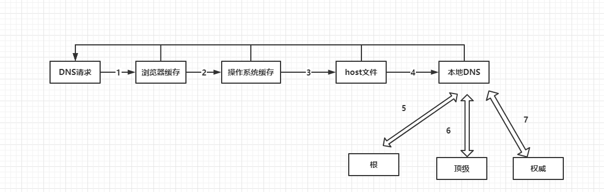

# Interview


## 作用域

变量的可访问范围，即 作用域 控制着变量的 可见性 和 生命周期，代码位置 （ 静态 的 词法作用域 ） 决定了变量的 可见性 与 生命周期


## 移动端 1px 问题

- 伪元素 + `border: 1px` +  `transform: scale(0.5)` （**优解**）
- 直接 `0.5px` ，安卓不支持
- `border-image` ，设置渐变，半边透明
- `border-shadow` ， 模拟边框，但有阴影、模糊， `safari` 不支持 `0.5px` 的 `box-shadow`


## 常见的性能优化相关问题


性能优化大致可以按以下方向进行


### 代码、性能问题

- 数据埋点上报
- 控制台 `network` 、 `performance` 工具分析
- `webpack-bundle-analyzer` 插件打包产物分析


### http 相关

- 强缓存、协商缓存
- `gzip` 压缩


### 图片相关

- 图片压缩，小图 `base64` （一般 `< 10kb` 转 `base64`）
- 图片懒加载、预加载
- 字体图标、 `svg`


### webpack 相关

- 多进程打包
- 缓存 `ast`
- 使用 `cdn`


### 代码优化

- 耗时计算使用 `web worker`


### 单页应用首屏加载速度慢可能原因

#### 可能原因

- 网络延迟
- 资源文件体积大小
- 脚本执行时间过长

#### 解决方法

- 减小入口文件体积
  - 路由懒加载，已函数形式加载路由
  - `Tree-shaking` 去除未使用的代码
- 静态资源本地缓存
  - 采用 `http` 缓存，后端返回资源设置 `Expire` 、 `Cache-control`、`Last-Modified`、`Etag` 等
  - 前端合理利用 `localStorage`
- `ui` 框架按需加载、 框架资源使用 `CDN`
- 图片压缩、懒加载
- 开启 `GZip` 压缩


## 前端埋点方案

- `new Image()` 方式上传，无跨域问题，不挂载页面不影响页面，采用 `1` 像素的 `gif` 图体积较小
- `navigator.sendBeacon(url, data)` 方法上传一些统计和诊断数据，不受页面卸载影响，不影响下一个页面的载入，可优先使用此方法来做埋点上传， `new Image()` 做兜底


## 组件和插件区别

- 编写形式
  - 组件编写：`.vue` 文件或 `.jsx`、`.tsx` 文件
  - 插件编写：包含 `install` 方法的**对象**
- 注册方式
  - 组件 `Vue.component()`
  - 插件 `Vue.use()`
- 使用场景
  - 组件用来构成 `App` 业务模块
  - 插件用来增强 `Vue` 功能


## 虚拟 dom

描述 `dom` 结构的 `js` 对象，相比于真实 `dom` ，更加轻便，对于需要频繁更新的 `dom` 结构，使用 虚拟 `dom` 更能体现其快速更新能力。

- 避免操作真实 `dom`
- 跨平台适配
- 框架设计所需，页面更新最小颗粒度为组件，但可能只需要更新组件中的某个文字，而不需要组件全更新，虚拟 `dom` 就能避免大量的无用更新


## v-for 时 key 在组件中的作用

`diff` 过程中，唯一的 `key` 能够有助于 `vue` 去判断同级的两个新旧节点是否相同节点，以便快速进行匹配判断节点是移动、创建、还是删除，从而减少不必要的重新渲染。


## keep-alive 理解

`vue` 的内置组件，能够保留组件切换时的数据状态，并采用 `LRU` 缓存策略。

但是 `keep-alive` 并没有提供清理缓存组件的办法，只能通过动态更新 `include` 的方式来失效想要清理缓存的组件。


## websocket 链接

`websocket` 是一种基于 `tcp` 协议的双向通信协议。

- 利用 `http` 建立连接，首先建立握手过程，与普通 `http` 请求类似，但包含了一些特殊头部字段，例如 `Upgrade: Websocket` 和 `Connection: Upgrade`
- 建立 `tcp` 连接
- 双向通信
- 断开连接，任意一方发送特殊的控制帧（ `Close Frame` ）


## https 是如何保证安全的

`https` 是一种基于 `tls/ssl` 协议的安全传输协议，它可以通过加密和认证等措施来保护数据传输过程中的安全性和隐私性。

- 加密传输 ： 使用 对称加密 来传输数据， 非对称加密 来传输公钥，保证 公钥 和 数据安全
- 身份认证 ： 使用 `ca` 证书对客户端和服务器进行认证，防止伪装攻击
- 完整性校验 ： 使用消息摘要算法对传输的数据进行校验，防止传输过程中被篡改
- 防止重放攻击 ： 使用时间戳和随机数等技术对请求和响应标记，防止重放攻击


## 小程序的双线程架构

双线程 是指小程序运行时开启两个线程运行的，分别是 **渲染线程** 和 **逻辑线程** 。

- 渲染线程 ， 负责渲染界面，包括解析 `wxml` 、 `wxss` 、样式计算、布局排版 和 绘制视图 等操作
- 逻辑线程 ， 处理业务逻辑、数据，包括调用 小程序 `api` 、 事件回调、请求网络，与客户端通信 等操作

通过双线程协同，能够实现小程序的高性能和流畅体验，并且不支持直接操作 `dom` 。

逻辑线程通过 `setData()` 方式通知渲染线程更新，渲染线程通过 `bindtap` 等事件方式调用逻辑线程。


## Promise.then 的第二个参数和 catch 的区别

两者都是处理 `reject` 情况的，推荐使用 `catch` 

- 使用 `then` 第二个参数时候，异常情况会在此被处理掉，不会往下链条传递
- `catch` 可以兜住整个 `promise` 链条上的异常情况，推荐使用


## web worker

`web worker` 是可以新建一个后台线程去执行耗时 `js` 任务，避免耗时任务阻塞主线程

- 独立线程 ， 避免阻塞主线程风险
- 沙箱环境 ， `web worker` 代码运行在一个受限沙箱中，不能访问 `dom` ，全局变量等资源，保证数据安全稳定
- 事件通信 ， 通过 `postMessage` 和 `message` 事件来与主线程通信


## DNS 查询

`DNS` 查询是 域名的 `IP` 地址查询过程，其中会依次经过 **递归查询**、**迭代查询**，如客户端发起一个 `DNS` 查询流程

1. 本地 浏览器 首先查询是否有该 域名 的缓存，有则返回
2. 查询 操作系统 中是否缓存该域名
3. 查询 本地 `host` 是否缓存该域名
4. 请求 本地 `DNS` 服务器，看是否缓存了该域名
5. 如果还找不到，本地 `DNS` 服务器则请求 **根域名服务器**。例如 想要查找 `www.baidu.com` 的 `IP` 地址，根域名服务器 会返回 `.com` 这个 顶级域名服务器 的 `IP` 地址，让 本地 `DNS` 服务器去这里找
6. 本地 `DNS` 服务器向 **顶级域名服务器** 发起查询 `www.baidu.com` 的 `IP` 地址 请求，返回该域名地址的 **权威服务器** 地址
7. 本地 `DNS` 服务器 向 **权威服务器** 发起查询 `www.baidu.com` 的 `IP` 地址 请求，返回该域名的 `IP` 地址
8. 本地 `DNS` 服务器将 查到的 `IP` 地址返回给客户端
9. 缓存 该 `IP` 地址


> 其中 第 `1 - 4` 为 递归查询 ， `5 - 7` 为 迭代查询




域名的层级关系类似于一个树状结构

- 根 `DNS` 服务器（ `.` ）
- 顶级域名服务器（ `.com` ）
- 权威 `DNS` 服务器（ `server.com` ）


## CDN 基本原理

内容分发网络，在用户访问相对集中的网络设置一些 缓存服务器 存放相对稳定的资源，当用户访问相应的资源时，由最近的 缓存服务器 （ `CDN` ） 代替 源站点 响应并返回资源。


## JsBridge 基本原理

`Native` 与 `Web` 之间通信的桥梁。

- `Native` 向 `Web` 发送消息
  - `Native` 端直接调用挂载在 `window` 上的全局方法，并可拿到返回值
- `Web` 向 `Native` 发送消息
  - 拦截式 - `Native` 拦截 `Web` 发出的约定格式的 `URL` 请求，参数从 `URL` 上获取
  - 注入式 - `Native` 通过 `Webview` 向 `window` 注入方法， `JS` 能够直接调用 `Native` 的代码逻辑，优先使用


## JS 值传递

`JS` 中没有引用传递，只有**值传递**，也就是函数参数传递过程，变量是拷贝的，拷贝完后两者内存地址指向并不一致，重新赋值并不影响另一个变量（注意是重新赋值，不是修改变量的某一个属性字段）。

`ES6` 中， `import` 的**具名导入**却是指向同一个内存地址的，修改导入的变量时，其他引入的该变量也随之改变，这也叫**符号绑定**，但不是函数参数的引用传递。


## 浏览器跨标签页通信方式

### 需求

实现浏览器跨标签通信，以实现数据同步、共享等需求，例如打开新标签页

### 方案

常见的跨标签页通信有以下 `7` 种

- `localStorage` 或 `sessionStorage`
- `BroadcastChannel`
- `Shared Worker`
- `Service Worker`
- `window.postMessage`
- `IndexedDB`
- `WebSocket`

### 特点

- `localStorage` 能做到不同标签页操作的是同一份数据，能实时同步更新数据，监听 `storage` 事件可以更新到页面
- `sessionStorage` 只在打开新标签页时（ `window.open` ）复制一份数据给新标签页，任一标签页数据修改并不会同步给其他标签页，这是因为 `sessionStorage` 的作用范围和生命周期只限于当前会话窗口
- `BroadcastChannel` 是浏览器的消息通信机制，可以实时通过广播通信
- `webWorker` 是独立的后台线程，也可以在其中实现数据通信共享
- `window.postMessage` 可以给指定的标签窗口发送消息
- `IndexedDB` 是浏览器提供的本地数据库
- `WebSocket` 需要服务端支持，但能实现不同浏览器间的数据同步，在线文档类的需求中常见使用

### 实际场景

在实际项目中，有些实时性的系统数据并不想保存在 `localStorage` 中永久保存，而是希望保存在随窗口消失的 `sessionStorage` 中，以便能够每次打开系统时都能重新请求保存

但系统中总有在另一个标签页中打开链接的需求，虽然此时 `sessionStorage` 中的数据会复制一份到新标签页，但是也希望能够像 `localStorage` 一样能够实现同步

意思就是，既需要 `localStorage` 的同步更新，又需要 `sessionStorage` 的随窗口消失的特性

#### 实现思路

由 `Tab A` 打开 `Tab B` ，同步 系统通用 或 用户基本信息 等数据

- 系统全局监听 `storage` 事件
- `Tab B` 中判断 `sessionStorage` 中没有储存的数据 `info` ，则设置一下 `localStorage.setItem('getSessionStorage', Date.now())`
- `Tab A` 中的 `storage` 事件会触发，则在 `storage` 事件回调中将 `info` 设置到 `localStorage` 中
- `Tab A` 设置 `localStorage` ，便会触发 `Tab B` 中的 `storage` 事件，则可以在 `storage` 事件回调中将 `event.newValue` 设置到 `sessionStorage` 中
- 最后删除 `localStorage` 中的信息


#### 注意
- `storage` 事件只会监听其他标签页的 `localStorage` 变化，当前标签的 `localStorage` 变化则不会
- 实际开发中，一般获取 `info` 数据需要在进入系统之前，但是 `storage` 事件触发是异步的，会导致还未监听 `storage` 就进入了系统，所以需要使用 `Promise` 来进行包装

```js
// 大致代码，但还需要根据实际情况在合适的地方移除 事件监听器
async function checkSession() {
  return new Promise(resolve => {
    if (!sessionStorage.userInfo || !Object.keys(JSON.parse(sessionStorage.userInfo)).length) {
      // 如果sessionStorage中没有userInfo或者userInfo是空的，设置localStorage中的一个时间戳
      localStorage.setItem('getSessionStorage', `${Date.now()}`)
    } else {
      // 如果sessionStorage中有userInfo，则直接resolve
      resolve()
    }
    window.addEventListener('storage', function(event) {
      if (event.key === 'getSessionStorage') {
        // 如果其他标签页或窗口设置了getSessionStorage，将sessionStorage中的userInfo存储到localStorage
        localStorage.setItem('userInfo', sessionStorage.getItem('userInfo'))
        // 然后移除localStorage中的getSessionStorage，表示该事件已处理
        localStorage.removeItem('userInfo')
      } else if (event.key === 'userInfo' && event.newValue) {
        // 如果其他标签页或窗口更新了userInfo，将其更新到当前标签页的sessionStorage中
        sessionStorage.setItem('userInfo', event.newValue)
        // 解析新值后，resolve这个Promise
        resolve()
      }
    })
  })
}
function checkLogin() {
  console.log('login')
}
async function main() {
  await checkSession(); // 等待checkSession执行完成
  checkLogin(); // 执行登录检查或其他操作
}
main()
```
